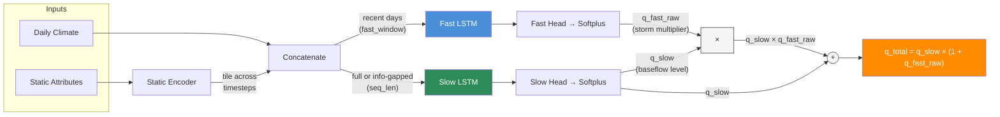
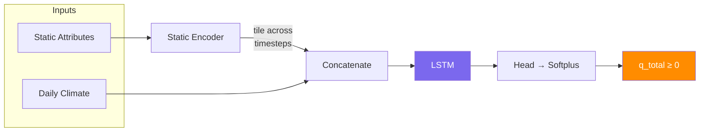

# neuralhyd-ca

> **⚠️ This project is under active development.** Model architectures and results may change without notice.

Daily streamflow prediction for California watersheds using LSTM networks conditioned on static watershed attributes.

The model predicts today's streamflow from a lookback window of observed daily climate forcing (precipitation, tmax, tmin) combined with static watershed properties. This is a **hindcast** model — it uses observed climate inputs, not future predictions.

A web-based viewer of the results is available at [https://neuralhyd-ca.onrender.com](https://neuralhyd-ca.onrender.com).

## Installation

Create the conda environment from the included `environment.yml`:

```bash
conda env create -f environment.yml
conda activate neuralhyd
```

## Quick Start

### 1. Prepare data

The data pipeline downloads USGS streamflow, builds climate forcing, computes static attributes, and runs QA/QC. Steps 1–8 must run in order for a fresh setup:

```bash
cd scripts
python prepare_data.py   # all steps (1-8)
```

### 2. Train

Run k-fold cross-validation (all hyperparameters in `scripts/config.toml`):

```bash
python train_kfold.py config_single_lstm_kfold.toml     # named experiment → data/training/output/single_lstm_kfold/
```

Named experiment configs

| Config | Model |
|---|---|
| `config_dual_lstm_kfold.toml` | Dual-pathway deterministic |
| `config_single_lstm_kfold.toml` | Single LSTM baseline |
| `config_dual_lstm_cmal_kfold.toml` | Dual-pathway with CMAL probabilistic head |
| `config_moe_lstm_kfold.toml` | Mixture-of-experts LSTM |
| `config_dual_lstm_subbasin_kfold.toml` | Dual-pathway, **HUC12 sub-basin inputs with gauge-level loss** (see [Subbasin mode](#subbasin-mode-huc-inputs-with-gauge-level-loss)) |

### 3. Post-process

`scripts/post_process.py` computes per-basin metrics, draws CDF/barplot figures, and runs trained checkpoints over historical climate to produce simulated timeseries:

```bash
python post_process.py --eval dual_lstm_kfold single_lstm_kfold
python post_process.py --cdf --barplot --runs dual_lstm_kfold single_lstm_kfold
```

### 4. Simulate

`post_process.py --simulate` produces daily streamflow timeseries using trained checkpoints. Two simulation modes are available:

| Target | Description |
|---|---|
| `--target training_watersheds` | Each basin is simulated by the fold checkpoint where it was held out (unbiased evaluation). Output: `q_total`, `q_fast`, `q_slow` in CFS. |
| `--target watersheds` or `huc8` | All k-fold checkpoints run every basin. Output: ensemble `q_mean`, `q_min`, `q_max`, `q_fast_mean`, `q_slow_mean` in CFS — the spread across folds quantifies structural uncertainty. |

```bash
python post_process.py --simulate dual_lstm_kfold --target training_watersheds
python post_process.py --simulate dual_lstm_kfold --target watersheds
```

Output CSVs are written to `data/eval/sim/<run>/<target>/historical/<basin_id>.csv`.

## Project Structure

```
scripts/
  train_kfold.py           # K-fold stratified spatial cross-validation
  train_final.py           # Train on full dataset for deployment
  prepare_data.py          # Data pipeline (steps 1–8 + analysis tasks)
  post_process.py          # Evaluation metrics, CDF/barplot figures, simulation
  sweep.py                 # Optuna hyperparameter sweep (fold 0)
  config.toml              # Default hyperparameters
  config_<name>.toml       # Named experiment configs
src/
  lstm/                    # Model package (config, dataset, model, train, loss, evaluate)
  data/                    # Data preparation modules
  eval/                    # Post-training metrics, plots, and simulation helpers
app/                       # Streamflow Explorer web app (FastAPI + React/Leaflet)
data/
  training/                # Model inputs: climate/, flow/, static/, watersheds/, output/
  raw/                     # Immutable source data
  prepare/                 # Intermediate pipeline outputs
  external/                # CEC VIC/NOAH-MP process-based model results for comparison
  eval/                    # Evaluation CSVs, CDF/barplot figures, simulated timeseries
```

## LSTM Architecture

Three model variants are available, selected via `model_type` in `config.toml`. All hyperparameters (hidden sizes, window lengths, feature lists, etc.) are configurable.

### Dual-Pathway LSTM (`model_type="dual"`, default)

Two parallel LSTM branches model distinct hydrological response timescales with **multiplicative composition**.



#### Design

- **Multiplicative composition**: `q_total = q_slow × (1 + q_fast_raw)` — the fast pathway amplifies baseflow during storms, so storm contribution scales with antecedent wetness.
- **Softplus activation** on both heads — strictly positive, smooth gradients, well-behaved near zero.
- **Fast pathway**: short lookback (`fast_window` days, e.g. 18–28) — captures storm runoff, event recession, direct surface response.
- **Slow pathway**: full lookback (`seq_len` days, default 365) — captures baseflow, snowmelt dynamics, seasonal soil-moisture storage.
- **Optional information gap** (`info_gap`): when enabled the slow pathway is blind to the last `fast_window` days, forcing pathway separation. When disabled (default), separation is driven by the multiplicative structure alone.
- A shared **per-basin ScaleHead** (see [Static encoder and scale head](#static-encoder-and-scale-head)) multiplies both pathway outputs so per-basin amplitude is absorbed end-to-end under the primary loss.

### Single LSTM Baseline (`model_type="single"`)

One LSTM processes the full lookback window. Simpler baseline without flow decomposition — returns zero for pathway components to maintain the same `(q_total, q_fast, q_slow)` interface.

### Mixture-of-Experts LSTM (`model_type="moe"`)

`K` independent LSTM experts run in parallel on the full lookback. An LSTM-attention gate with a learnable softmax temperature (τ) produces mixture weights over experts; expert hidden states are combined as `m = Σₖ πₖ hₖ` and decoded by a shared head. Pathway outputs are zero-filled to keep the same 3-tuple interface. See `moe_*` options in `scripts/config.toml`.



### Probabilistic output (optional)

Setting `output_type = "cmal"` replaces the scalar flow head with a **CMAL** (Countable Mixture of Asymmetric Laplacians) distributional head. The model predicts `K` mixture components, each with a weight `πₖ`, location `μₖ`, and left/right scales `b_L,k`, `b_R,k`, which together capture the skewed, heavy-tailed distribution of streamflow. The per-basin `ScaleHead` multiplies all three of `μ`, `b_L`, `b_R` so the entire mixture distribution scales with `s_b`. Training uses NLL or CRPS (selected via `cmal_loss`); the dual-pathway heads are retained so the Lyne–Hollick auxiliary loss still supervises `q_slow` and `q_fast`. CMAL is supported for `model_type = "dual"` and `"single"`.

### Static encoder and scale head

All architectures share the same static conditioning. A small MLP (optionally a [grouped encoder](#grouped-static-encoder) with per-feature-family sub-MLPs) projects raw watershed attributes into a low-dimensional embedding that is then tiled across every dynamic timestep. This lets the LSTMs produce appropriately different runoff responses for the same precipitation signal across basins.

A second small MLP — the **`ScaleHead`** — consumes the same static embedding and produces a per-basin log-scale `log s_b`, clamped to `[−4, 4]`. The final linear layer is zero-initialised so `s_b = 1` at the start of training; from there it drifts end-to-end under the primary loss. All pathway outputs (or all CMAL mixture parameters, when used) are multiplied by `s_b`. This keeps the LSTM output in a compact range while letting per-basin amplitude be absorbed by the scale head, without requiring observed flow to set it.

Static features include watershed geometry (area, slope), land cover (forest fraction), soil texture, river network characteristics, geology/lithology classes, and long-term climate normals (mean precipitation, PET, aridity index, snow fraction). Features with heavy right skew (e.g. area) are log-transformed before z-score normalisation.

#### Grouped static encoder

When `static_feature_groups` is set in the config, each semantic group (topography, network, soil, climate) gets its own small encoder and the group embeddings are concatenated and projected to the final embedding dimension. Otherwise a single flat MLP is used.

### Loss function

The total training loss has up to two components:

```
L_total = L_primary  +  aux_loss_weight × L_aux
```

Both terms are per-sample weighted means: every sample carries a **per-basin gradient-balancing weight** `w_b` (described below), and `L_aux` additionally multiplies the fast-pathway error by a per-sample **event-adaptive boost** (also below). All weights are detached — they modulate the loss magnitude but never flow through gradients themselves.

#### Primary loss

The primary loss supervises total predicted streamflow `Q̂ = q_total` against observed flow `Q`, both normalised by per-basin mean daily precipitation so they are dimensionless runoff ratios.

Two modes are available, both selected through `log_loss_lambda` (`λ`):

- **Pure MSE** (`λ = 0`): standard mean squared error. Simple and effective when the main concern is overall volume accuracy.
- **Blended MSE + log-MSE** (`0 < λ ≤ 1`): a log-space term amplifies sensitivity to low flows:

  ```
  L_primary = (1 − λ) · MSE(Q, Q̂)  +  λ · MSE(log(Q + ε), log(Q̂ + ε))
  ```

  `ε = log_loss_epsilon` prevents `log(0)`. For CMAL models `L_primary` is the CMAL NLL or CRPS instead (see [probabilistic output](#probabilistic-output-optional)).

#### Auxiliary loss (dual-pathway only)

The primary loss alone doesn't constrain *how* flow is divided between pathways — the model could route all flow through either branch and still minimise total error. Without guidance, the multiplicative structure tends to collapse toward one pathway dominating.

The auxiliary loss supervises each pathway component against targets from **Lyne-Hollick digital baseflow separation**, a single-pass recursive filter that splits observed streamflow into:

- **Quickflow** → target for `q_fast` (high-frequency storm response)
- **Baseflow** → target for `q_slow` (slowly-varying filtered component)

```
L_aux = 0.5 · [ mean_t( w_extreme(t) · (q_fast(t) − quickflow(t))² )
              + MSE(q_slow, baseflow) ]
```

`w_extreme(t)` is the event-adaptive boost below (equal to 1 on non-extreme days).  These are **soft targets**, not hard constraints: the model can deviate from the Lyne–Hollick decomposition where the data supports it — the filter is a rough heuristic, and the model may learn a better separation.

#### Per-basin gradient-balancing weight

The variance of the dimensionless target `Q / precip_mean` spans roughly three orders of magnitude across basins. Without compensation, a handful of high-variance basins would dominate every gradient step. Each sample therefore carries a basin-level weight

```
w_b  =  1 / max(Var_b, var_floor) ^ basin_loss_weight_exponent
```

computed once from the training split (`basin_loss_weight_exponent` defaults to `0.25`, i.e. fourth-root inverse variance; `0` disables the weighting, `0.5` gives sqrt-inverse-variance, `1.0` gives full inverse variance). Losses are computed as `Σ_i w_i · ℓ_i / Σ_i w_i` so the overall loss magnitude is independent of the weight scale.

#### Extreme-event peak boost (auxiliary loss only)

On top of `w_b`, the fast-pathway auxiliary loss multiplies each sample by an event-adaptive boost `w_extreme`. Each basin gets its **own** ramp thresholds, computed once as quantiles of that basin's normalised flow distribution:

- `q_start = Q_b(extreme_start_quantile)` — defaults to the basin's p99
- `q_top   = Q_b(extreme_top_quantile)`   — defaults to the basin's p99.9

The weight ramps from 1 to `extreme_peak_boost` between these per-basin thresholds:

```
w_extreme(y)  =  1  +  (extreme_peak_boost − 1) · clamp( (y − q_start) / (q_top − q_start),  0,  1 )
```

Because the thresholds are quantiles, every basin has the same fraction of its days in the ramp (the top `1 − extreme_start_quantile`) regardless of whether it is a flashy T1 storm-driven basin or an ephemeral T2 stream. This focuses pathway-separation learning on each basin's own extreme events without distorting the primary loss gradient. Set `extreme_peak_boost = 1.0` to disable.

### Training

Training uses AdamW (Adam with decoupled weight decay) and an optional **warmup → cosine-annealing** learning-rate schedule (`warmup_epochs` → `CosineAnnealingLR` over `num_epochs`). Gradient clipping and early stopping are always enabled. **Gaussian input noise** (`input_noise_std`) is added to normalised climate inputs during training — a strong regulariser that improves generalisation to unseen basins by preventing the model from memorising exact input values. Once validation improvement stalls for `patience` epochs, **Stochastic Weight Averaging (SWA)** activates at a fixed low LR (`swa_lr`) and averages weights for `swa_patience` further epochs; the final checkpoint is the SWA average (when `use_swa = true`).

### Data and normalisation

The dataset covers **210 basins** across 3 hydroclimatic tiers — Tier 1 (89 warm, rainfall-dominated), Tier 2 (92 transitional rain-snow), and Tier 3 (29 cold, snow-dominated). These are the basins that pass strict QA/QC (9 of the original 219 USGS gages are excluded for data-quality issues). Climate records span 1915–2018 (~38k days of daily precip, tmax, tmin); streamflow records vary by basin (typically 1950s–present). Static attributes are derived from BasinATLAS and climate statistics.

Targets and inputs are normalised as follows:

- **Flow target**: converted from cfs to **mm/day** using basin area, then divided by each basin's **mean daily precipitation** (mm/day) computed from its own climate record. The resulting target is a dimensionless runoff ratio. Because the denominator depends only on the climate CSV — not observed flow — trained models can be applied to any new basin (HUC8, HUC10, ungauged). The per-basin `ScaleHead` further refines the effective scale during training.
- **Climate inputs** (precip, tmax, tmin): z-scored globally using **training-basin** statistics only.
- **Static attributes**: z-scored globally using training-basin statistics; heavy-tailed features such as drainage area are `log10`-transformed first (the raw area is retained for the cfs → mm/day conversion).

### Validation

5-fold stratified spatial cross-validation ensures the model is tested on basins it has never seen. **Basins — not timesteps — are the unit of splitting**, with each fold holding out ~20% of the basins in every tier. No watershed appears in both train and validation within a fold, so every evaluation is effectively on an ungauged basin. Reported metrics are per-tier medians of **NSE, KGE, FHV (high-flow volume bias), FEHV (extreme high-flow volume bias), and FLV (low-flow bias)**.


Each basin appears in exactly one fold's validation set — every basin is evaluated as if ungauged.

### Hyperparameter sweeps

`scripts/sweep.py` runs an Optuna single-objective search on fold 0, maximising a tier-weighted composite of KGE and |FHV|. MedianPruner kills unpromising trials early:

```bash
KMP_DUPLICATE_LIB_OK=TRUE python sweep.py config_dual_lstm_cmal_kfold.toml --n-trials 100
python sweep.py config_dual_lstm_cmal_kfold.toml --report     # inspect results
```

### Inference on new basins

Checkpoints bundle the model weights plus all normalisation statistics needed to apply the model to a basin it has never seen — climate mean/std, static mean/std, and the per-basin `scale` map (mean daily precipitation in mm/day). Because the initial scale is computed directly from a basin's climate CSV and the learned `ScaleHead` is stored as part of the model weights, no observed flow is needed at inference time:

```python
import numpy as np
import torch

from src.lstm.config import load_config
from src.lstm.model import build_model
from src.lstm.train import load_checkpoint

device = torch.device("cuda" if torch.cuda.is_available() else "cpu")
config = load_config("scripts/config.toml")
model = build_model(config).to(device).eval()
norm_stats = load_checkpoint("data/training/output/fold_0/best_model.pt", model, device)

clim_mean, clim_std = norm_stats["climate"]      # (n_dyn,), (n_dyn,)
stat_mean, stat_std = norm_stats["static"]       # (n_static,), (n_static,)
# norm_stats["scale"][basin_id]  → mean daily precip (mm/day) for that basin.
# For a new basin, compute it directly from the basin's climate CSV.

# Normalise a new basin's inputs with these, run model.forward(x_dyn, x_static),
# and denormalise.  The model predicts dimensionless runoff ratios, so:
precip_mean = float(np.mean(new_basin_climate["precip_mm"]))   # from the climate CSV
q_pred_mm_day = model_output.detach().cpu().numpy() * precip_mean
```

## Web Application

**Streamflow Explorer** is an interactive web app for visualising model results. It serves a map of California watersheds coloured by tier or performance metric (NSE, KGE), with a side panel showing observed vs. predicted streamflow timeseries and pathway decomposition (fast/slow) for any selected basin. It also displays VIC process-based model results from the [CEC C-DAWG](https://www.energy.ca.gov/programs-and-topics/topics/research-and-development/climate-data-and-analysis-working-group-c-dawg) for comparison (see [Bass et al., 2025](https://www.energy.ca.gov/sites/default/files/2025-04/05_HydrologyProjections_DataJustificationMemo_BassEtAl_Adopted_v3_ada.pdf); [model documentation](https://wrf-cmip6-noversioning.s3.amazonaws.com/ben_temp/d03_3km/CEC/0_Hyd_Model_Documentation/CEC_Noah_MP_VIC_Hydrology_Model_Description.pdf)).

```bash
python -m app serve                           # http://127.0.0.1:8000
python -m app serve --port 9000
```

The frontend is a React + Leaflet application; a pre-built bundle is served from `app/static/`. The backend is FastAPI, serving GeoJSON layers and timeseries data from `app/data/`.

## Subbasin mode (HUC inputs with gauge-level loss)

Gauged training basins span a wide range of sizes (a few km² to several thousand km²). The subbasin mode normalises this by predicting flow at the HUC12 level (≈30–100 km² each; HUC10 is also supported) and aggregating the subbasin predictions up to each gauge for the loss:

$$ \hat Q^{\text{gauge}}_{\text{mm/day}} = \sum_{i=1}^{N_g} \frac{A_i}{A_g} \cdot \hat y_i $$

where $A_i, A_g$ are the subbasin and gauge areas and $\hat y_i$ is the model's raw, area-normalised prediction for subbasin $i$ in mm/day. The model is trained directly against observed gauge flow in mm/day — no per-subbasin precipitation scaling is applied. A gauge is dropped only when it sits inside a **single** subbasin (its entire footprint overlaps exactly one) AND its own area is less than 85 % of that subbasin's area; gauges that span two or more subbasins are always kept.

### Preparation

Run step 9 once (requires `--meteo-dir` pointing at the VIC grids). HUC12 is the default; pass `--subbasin-level huc10` for the coarser level:

```bash
python prepare_data.py --step 9 --meteo-dir <path-to-WGEN-grids>
# or, explicitly:
python prepare_data.py --step 9 --subbasin-level huc12 --meteo-dir <path-to-WGEN-grids>
```

This produces `data/prepare/geo_ops/HUC12_{Intersect,Kept,In_Scope}_*.csv`, full-domain HUC12 climate + static at `data/eval/{climate,static}/huc12/` (every HUC12 in the domain — used for ungauged-basin simulation), and the in-scope manifest subset copied into `data/training/{climate,static}/huc12/` for trainable configs.

### Training

```bash
python train_kfold.py config_dual_lstm_subbasin_kfold.toml
```

Notes:
- Each sample is a padded stack of up to $N_{\max}$ subbasins; dropped/padded rows have `mask=0` and contribute nothing to the aggregate.
- Loss (MSE + Lyne-Hollick pathway auxiliary for dual) is computed in **mm/day** on the aggregated gauge flow.
- CMAL output is **not** supported in this mode.
- A subbasin feeding both a train and a val gauge is not label leakage — the gauge-level target is never duplicated across folds.
- Switch level via the config: set `subbasin_level = "huc10"` and point the four `subbasin_*` paths at the HUC10 artefacts.
