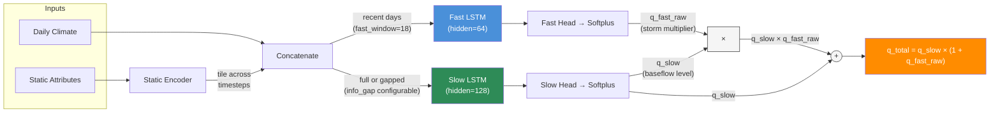
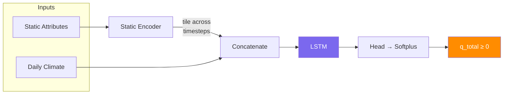
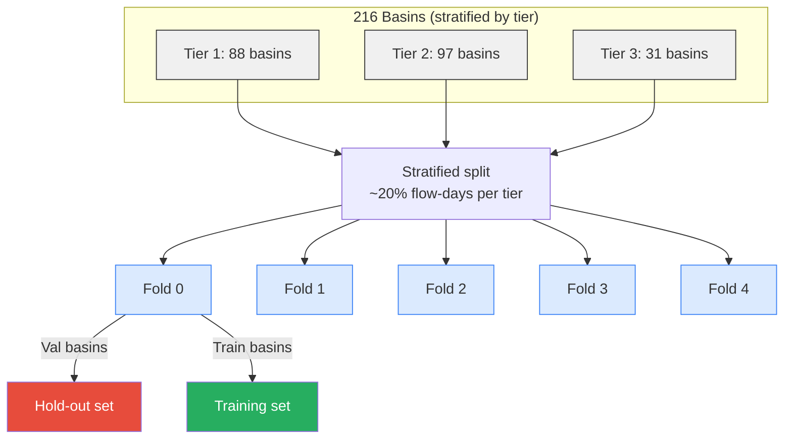

# neuralhyd-ca

> **⚠️ This project is under active development.** APIs, model architectures, and results may change without notice.

Daily streamflow prediction for 216 California USGS watersheds using LSTM networks conditioned on static watershed attributes.

The model predicts today's streamflow from a lookback window of observed daily climate forcing (precipitation, tmax, tmin) combined with static watershed properties. This is a **hindcast** model — it uses observed climate inputs, not future predictions.

A web-based viewer of the results is available at [https://neuralhyd-ca.onrender.com](https://neuralhyd-ca.onrender.com).

## Installation

Create the conda environment from the included `environment.yml`:

```bash
conda env create -f environment.yml
conda activate neuralhyd
```

## Quick Start

### 1. Prepare data

The data pipeline downloads USGS streamflow, builds climate forcing, computes static attributes, and runs QA/QC. Steps 1–8 must run in order for a fresh setup:

```bash
cd scripts
python prepare_data.py                        # all steps (1–8)
python prepare_data.py --step 1               # single step
python prepare_data.py --step 2 --meteo-dir /path/to/gridded/meteo
```

Step 2 requires a `--meteo-dir` pointing to gridded meteorological files. After all steps complete, optional analysis tasks are available:

```bash
python prepare_data.py --analysis map_watersheds
python prepare_data.py --analysis tier_characteristics
```

### 2. Train

Run k-fold cross-validation (all hyperparameters in `scripts/config.toml`):

```bash
python train_kfold.py                         # uses config.toml → data/training/output/
python train_kfold.py config_single.toml      # named experiment → data/training/output/single/
```

## Project Structure

```
scripts/
  train_kfold.py        # K-fold stratified spatial cross-validation
  train_final.py        # Train on full dataset for deployment
  prepare_data.py       # Data pipeline (steps 1–8 + analysis tasks)
  config.toml           # All hyperparameters
src/
  lstm/                 # Model package (config, dataset, model, train, loss, evaluate)
  data/                 # Data preparation modules
app/                    # Streamflow Explorer web app (FastAPI + React/Leaflet)
data/
  training/             # Model inputs: climate/, flow/, static/, watersheds/, output/
  raw/                  # Immutable source data
  external/             # CEC VIC/NOAH-MP process-based model results for comparison
```

## LSTM Architecture

Two model variants are available, selected via `model_type` in `config.toml`. All hyperparameters (hidden sizes, window lengths, feature lists, etc.) are configurable — see `scripts/config.toml` for current values.

### Dual-Pathway LSTM (`model_type="dual"`, default)

Two parallel LSTM branches model distinct hydrological response timescales with **multiplicative composition**.



#### Design

- **Multiplicative composition**: `q_total = q_slow × (1 + q_fast_raw)` — the fast pathway amplifies baseflow during storms, so storm contribution scales with antecedent wetness.
- **Softplus activation** on both heads — strictly positive, smooth gradients, well-behaved near zero.
- **Fast pathway**: short lookback (18 days) — captures storm runoff, event recession, direct surface response.
- **Slow pathway**: full lookback (365 days) — captures baseflow, snowmelt dynamics, seasonal soil-moisture storage.

### Single LSTM Baseline (`model_type="single"`)

One LSTM processes the full lookback window. Simpler baseline without flow decomposition — returns zero for pathway components to maintain the same `(q_total, q_fast, q_slow)` interface.



### Static Encoder (shared)

Both architectures use the same static encoder — a small MLP that projects raw watershed attributes into a low-dimensional embedding, which is then tiled across each dynamic timestep. This conditions the LSTMs on watershed properties so the same precipitation signal produces appropriately different runoff responses for different basins.

Static features include watershed geometry (area, slope), land cover (forest fraction), soil texture, river network characteristics, geology/lithology classes, and long-term climate normals (mean precipitation, PET, aridity index, snow fraction). Features with heavy right skew (e.g. area) are log-transformed before normalisation.

### Loss Function

The total training loss has up to three components:

```
L_total = L_primary + w_aux × L_aux
```

#### Primary loss

The primary loss supervises total predicted streamflow (`q_total`) against observed flow (both normalised by per-basin std).

Two modes are available:

- **MSE** (default): Standard mean squared error. Simple and effective when the main concern is overall volume accuracy.
- **Blended MSE + log-MSE**: Adds a log-space term that amplifies sensitivity to low flows, where absolute errors are small but relative errors can be large:

  ```
  L_primary = (1 − λ) × MSE(Q, Q̂) + λ × MSE(log(Q + ε), log(Q̂ + ε))
  ```

  The `λ` parameter controls the low-flow emphasis; `ε` prevents log(0).

#### Auxiliary loss (dual-pathway only)

The primary loss alone doesn't constrain *how* flow is divided between pathways — the model could route all flow through either branch and still minimise total error. Without guidance, the multiplicative structure tends to collapse toward one pathway dominating.

The auxiliary loss supervises each pathway component against targets from **Lyne-Hollick digital baseflow separation**, a single-pass recursive filter that splits observed streamflow into:

- **Quickflow** → target for `q_fast` (high-frequency storm response)
- **Baseflow** → target for `q_slow` (slowly-varying filtered component)

```
L_aux = 0.5 × [MSE_asym(q_fast, quickflow) + MSE(q_slow, baseflow)]
```

The fast-pathway term uses **asymmetric weighting** — under-prediction of storm peaks is penalised more heavily than over-prediction. This encourages the model to capture extreme events rather than smooth them out.

These are **soft targets**, not hard constraints. The model can deviate from the Lyne-Hollick decomposition where the data supports it — the filter is a rough heuristic, and the model may learn a better separation.

### Training

Training uses Adam with weight decay, a warmup → cosine annealing LR schedule, gradient clipping, and early stopping. **Gaussian input noise** is added to normalised climate inputs during training — this acts as a strong regulariser that improves generalisation to unseen basins by preventing the model from overfitting to exact input values. **Stochastic Weight Averaging (SWA)** activates on the first learning plateau and averages weights until a second plateau, further improving generalisation.

### Data and Normalisation

The dataset covers **216 basins** across 3 hydroclimatic tiers — Tier 1 (88 warm, rainfall-dominated), Tier 2 (97 transitional rain-snow), and Tier 3 (31 cold, snow-dominated). Climate records span 1915–2018 (~38k days of daily precip, tmax, tmin); streamflow records vary by basin (typically 1950s–present). Static attributes are derived from BasinATLAS and climate statistics.

Flow targets are converted from cfs to **mm/day** using basin area, then divided by per-basin std — this removes area as a confound and makes flow comparable across basins. Climate inputs are z-score normalised using training-basin statistics only. Static attributes are also z-scored globally, with selected features (e.g. area) log-transformed first.

### Validation

5-fold stratified spatial cross-validation ensures the model is tested on basins it has never seen. Basins — not timesteps — are the unit of splitting, with each fold holding out ~20% of flow-days per tier. No watershed appears in both train and validation within a fold. Primary metrics are **NSE, KGE, FHV (peak flow bias), and FLV (low flow bias)**.



Each basin appears in exactly one fold's validation set — every basin is evaluated as if ungauged.

### Running

To switch between model architectures, set `model_type` in the TOML:

```toml
[model]
model_type = "dual"   # or "single"
```

### Inference on new basins

Checkpoints bundle model weights and normalisation statistics (climate mean/std, static mean/std, per-basin flow std) so that a trained model can be applied to basins it has never seen — without access to the original training data:

```python
from src.lstm.train import load_checkpoint
from src.lstm.model import build_model
from src.lstm.config import load_config

config = load_config("scripts/config.toml")
model = build_model(config)
norm_stats = load_checkpoint("data/training/output/fold_0/best_model.pt", model, device)

clim_mean, clim_std = norm_stats["climate"]
stat_mean, stat_std = norm_stats["static"]
# Normalise a new basin's inputs with these, then run model.forward()
```
## Web Application

**Streamflow Explorer** is an interactive web app for visualising model results. It serves a map of California watersheds coloured by tier or performance metric (NSE, KGE), with a side panel showing observed vs. predicted streamflow timeseries and pathway decomposition (fast/slow) for any selected basin. It also displays VIC process-based model results from the [CEC C-DAWG](https://www.energy.ca.gov/programs-and-topics/topics/research-and-development/climate-data-and-analysis-working-group-c-dawg) for comparison (see [Bass et al., 2025](https://www.energy.ca.gov/sites/default/files/2025-04/05_HydrologyProjections_DataJustificationMemo_BassEtAl_Adopted_v3_ada.pdf); [model documentation](https://wrf-cmip6-noversioning.s3.amazonaws.com/ben_temp/d03_3km/CEC/0_Hyd_Model_Documentation/CEC_Noah_MP_VIC_Hydrology_Model_Description.pdf)).

```bash
python -m app serve                           # http://127.0.0.1:8000
python -m app serve --port 9000
```

The frontend is a React + Leaflet application; a pre-built bundle is served from `app/static/`. The backend is FastAPI, serving GeoJSON layers and timeseries data from `app/data/`.