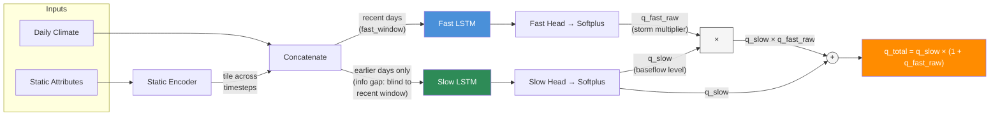
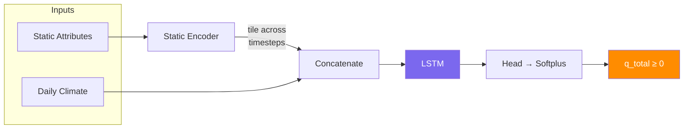
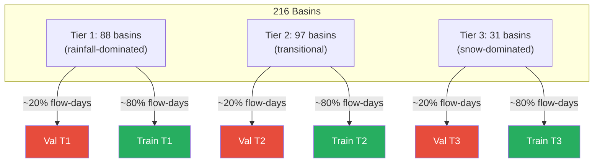

# neuralhyd-ca

Daily streamflow prediction for 216 California USGS watersheds using LSTM networks conditioned on static watershed attributes.

The model predicts today's streamflow from a lookback window of observed daily climate forcing (precipitation, tmax, tmin) combined with static watershed properties. This is a **hindcast** model — it uses observed climate inputs, not future predictions.

## Architecture

Two model variants are available, selected via `model_type` in `config.toml`. All hyperparameters (hidden sizes, window lengths, feature lists, etc.) are configurable — see `config.toml` for current values.

### Dual-Pathway LSTM (`model_type="dual"`, default)

Two parallel LSTM branches model distinct hydrological response timescales with **multiplicative composition** and an **information gap** that enforces physical separation between pathways.



#### Key design choices

| Feature | Design | Rationale |
|---------|--------|-----------|
| **Multiplicative composition** | `q_total = q_slow × (1 + q_fast_raw)` | Fast pathway amplifies baseflow during storms. Storm contribution scales with antecedent wetness — physically realistic. |
| **Information gap** | Slow LSTM is blind to the last `fast_window` days | Prevents slow pathway from learning storm responses. Forces all event-scale signal through the fast pathway. |
| **Softplus activation** | `Softplus(x)` on both heads | Strictly positive, smooth gradients, well-behaved near zero. |

#### Pathway interpretation

| Pathway | Role |
|---------|------|
| **Fast** | Short lookback — storm runoff, event recession, direct surface response |
| **Slow** | Long lookback minus info gap — baseflow, snowmelt dynamics, seasonal soil-moisture storage |

### Single LSTM Baseline (`model_type="single"`)

One LSTM processes the full lookback window. Simpler baseline without flow decomposition — returns zero for pathway components to maintain the same `(q_total, q_fast, q_slow)` interface.



### Static Encoder (shared)

Both architectures use the same static encoder — a small MLP that projects raw watershed attributes into a low-dimensional embedding, which is then tiled across each dynamic timestep. This conditions the LSTMs on watershed properties so the same precipitation signal produces appropriately different runoff responses for different basins.

Static features include watershed geometry (area, slope), land cover (forest fraction), soil texture, river network characteristics, geology/lithology classes, and long-term climate normals (mean precipitation, PET, aridity index, snow fraction). Features with heavy right skew (e.g. area) are log-transformed before normalisation.

## Loss Function

The total training loss has up to three components:

```
L_total = L_primary + w_aux × L_aux
```

### Primary loss

The primary loss supervises total predicted streamflow (`q_total`) against observed flow (both normalised by per-basin std).

Two modes are available:

- **MSE** (default): Standard mean squared error. Simple and effective when the main concern is overall volume accuracy.
- **Blended MSE + log-MSE**: Adds a log-space term that amplifies sensitivity to low flows, where absolute errors are small but relative errors can be large:

  ```
  L_primary = (1 − λ) × MSE(Q, Q̂) + λ × MSE(log(Q + ε), log(Q̂ + ε))
  ```

  The `λ` parameter controls the low-flow emphasis; `ε` prevents log(0).

### Auxiliary loss (dual-pathway only)

The primary loss alone doesn't constrain *how* flow is divided between pathways — the model could route all flow through either branch and still minimise total error. Without guidance, the multiplicative structure tends to collapse toward one pathway dominating.

The auxiliary loss supervises each pathway component against targets from **Lyne-Hollick digital baseflow separation**, a single-pass recursive filter that splits observed streamflow into:

- **Quickflow** → target for `q_fast` (high-frequency storm response)
- **Baseflow** → target for `q_slow` (slowly-varying filtered component)

```
L_aux = 0.5 × [MSE_asym(q_fast, quickflow) + MSE(q_slow, baseflow)]
```

The fast-pathway term uses **asymmetric weighting** — under-prediction of storm peaks is penalised more heavily than over-prediction. This encourages the model to capture extreme events rather than smooth them out.

These are **soft targets**, not hard constraints. The model can deviate from the Lyne-Hollick decomposition where the data supports it — the filter is a rough heuristic, and the model may learn a better separation.

## Training

The training loop uses:
- **Adam optimiser** with weight decay
- **Warmup → cosine annealing** LR schedule
- **Stochastic Weight Averaging (SWA)** — activates on the first learning plateau and averages model weights until a second plateau, which often improves generalisation
- **Gaussian input noise** on normalised climate inputs for regularisation
- **Gradient clipping** for training stability
- **Early stopping** with a minimum relative improvement threshold

## Data

- **216 basins** across 3 hydroclimatic tiers:
  - **Tier 1** (88): Warm, low-elevation, rainfall-dominated
  - **Tier 2** (97): Transitional, mixed rain-snow — hardest to generalise
  - **Tier 3** (31): Cold, high-elevation, snow-dominated — requires long memory
- **Climate records**: 1915–2018 (~38k days), area-weighted daily precip, tmax, tmin
- **Streamflow records**: Variable per basin (typically 1950s–present)
- **Static attributes**: Derived from BasinATLAS and climate statistics

## Validation

3-fold stratified spatial cross-validation:
- Basins (not timesteps) are the unit of splitting
- Each fold holds out ~20% of **flow-days** per tier
- No watershed appears in both train and validation within a fold
- Tests ungauged-basin generalisation
- Primary metrics: **per-tier median NSE, KGE, FHV (peak flow bias), FLV (low flow bias)**



## Normalisation

| Component | Method |
|-----------|--------|
| Flow target | Converted **cfs → mm/day** using basin area, then divided by per-basin std |
| Climate inputs | z-score (global, training basins only) |
| Static attributes | z-score (global, training basins); selected features log-transformed first |


## Project Structure

```
train_kfold.py          # Entry point: k-fold stratified spatial CV
train_final.py          # Train on full dataset for deployment
prepare_data.py         # Data preparation pipeline (steps 1–8 + analysis)
config.toml             # Default experiment configuration
src/
  config.py             # Config dataclass + load_config() — typed container for TOML values
  dataset.py            # load_all_data(), create_folds(), compute_norm_stats(), HydroDataset
  model.py              # DualPathwayLSTM, SingleLSTM, StaticEncoder, build_model()
  train.py              # train_epoch(), validate_epoch(), train_model()
  loss.py               # mse_loss, blended_loss, pathway_auxiliary_loss, NSE/KGE/FHV/FLV metrics
  evaluate.py           # evaluate_basin(), evaluate_fold()
  data/                 # Data preparation modules (called by prepare_data.py)
    paths.py            # Centralised path constants
    retrieve_flows.py   # Step 1: download USGS flows
    develop_climate.py  # Step 2: develop climate forcing
    verify_climate.py   # Step 3: verify climate data
    develop_static_attr.py  # Step 4: compute basin physical attributes
    develop_static_clim.py  # Step 5: compute climate statistics
    clean_flows.py      # Step 6: flow/precip exceedance filter
    run_qa_qc.py        # Step 7: QA/QC report
    flow_precip_qaqc.py # Step 8: tier sort + final QA CSVs
    map_watersheds.py   # Analysis: watershed map
    plot_cdf_distributions.py  # Analysis: tier characterisation CDFs
data/
  training/             # All final training/evaluation inputs and model outputs
    climate/            # climate_<basin_id>.csv — daily precip_mm, tmax_c, tmin_c
    flow/               # tier_{1,2,3}/<basin_id>_cleaned.csv — daily flow + climate
    static/             # Physical_Attributes_Watersheds.csv, Climate_Statistics_Watersheds.csv
    watersheds/         # watersheds.geojson, watersheds.csv
    output/             # Created at runtime — per-fold checkpoints, basin results, timeseries
  raw/                  # Immutable source data (USGS flow downloads, watershed geometry)
  prepare/              # Intermediate pipeline outputs (see data/README.md)
  external/             # External comparison data (CEC process-based model results)
```

## Running

All hyperparameters live in `config.toml`. Pass an alternate TOML file to run a named experiment — the output directory is derived from the filename:

```bash
python train_kfold.py                      # uses config.toml → data/training/output/
python train_kfold.py config_single.toml   # → data/training/output/single/
```

To switch between model architectures, set `model_type` in the TOML:

```toml
[model]
model_type = "dual"   # or "single"
```

### Inference on new basins

Checkpoints bundle model weights and normalisation statistics (climate mean/std, static mean/std, per-basin flow std) so that a trained model can be applied to basins it has never seen — without access to the original training data:

```python
from src.train import load_checkpoint
from src.model import build_model
from src.config import load_config

config = load_config("config.toml")
model = build_model(config)
norm_stats = load_checkpoint("data/training/output/fold_0/best_model.pt", model, device)

clim_mean, clim_std = norm_stats["climate"]
stat_mean, stat_std = norm_stats["static"]
# Normalise a new basin's inputs with these, then run model.forward()
```

## Requirements

- Python ≥ 3.11
- PyTorch ≥ 2.0
- pandas, numpy, scikit-learn, matplotlib, tqdm
- macOS Apple Silicon (MPS) recommended; CUDA and CPU also supported
