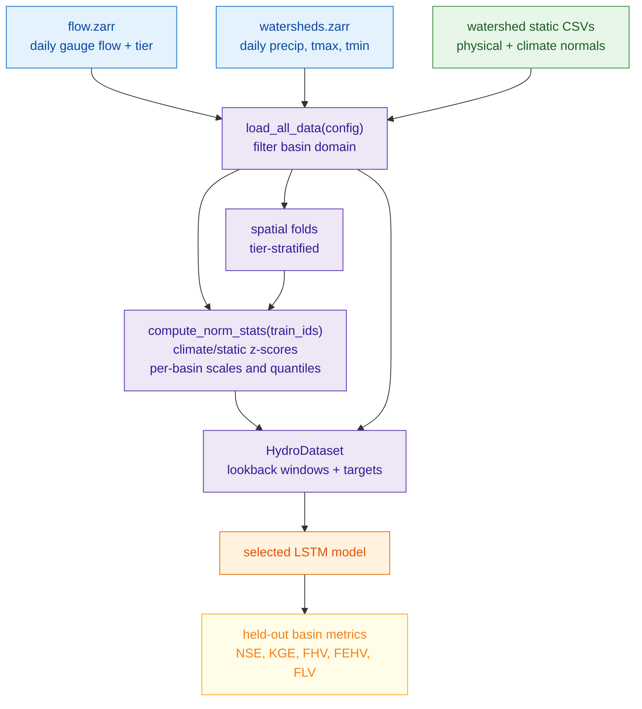
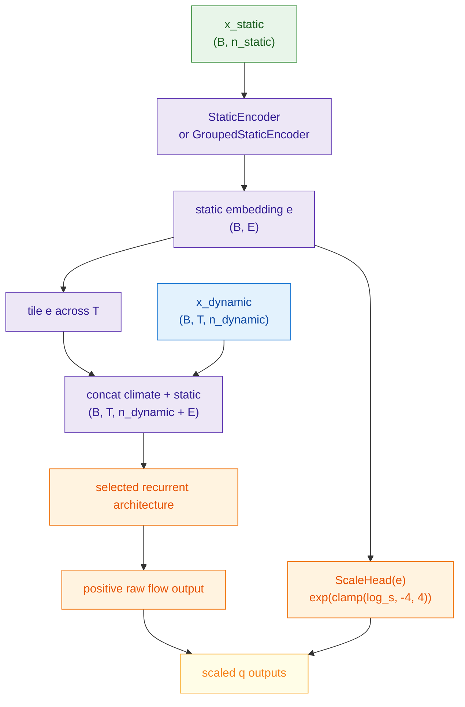
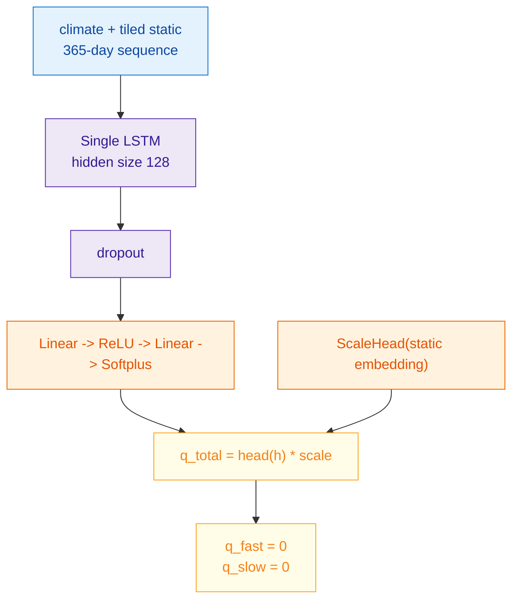
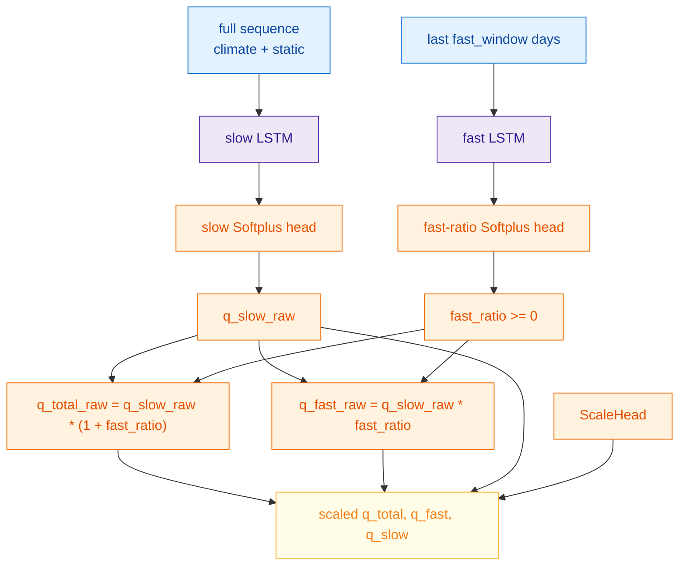
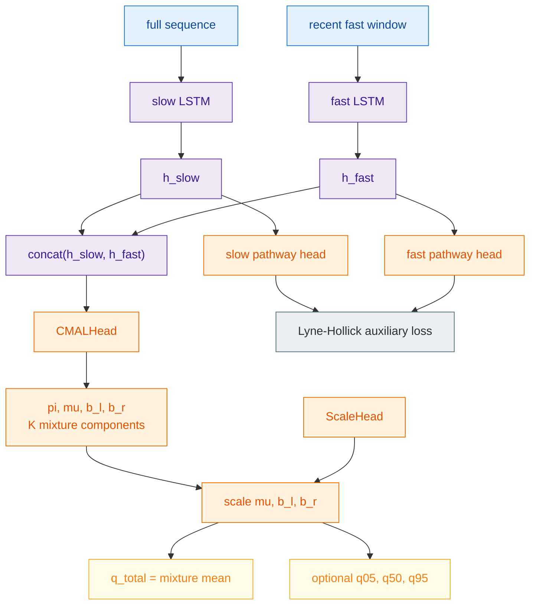
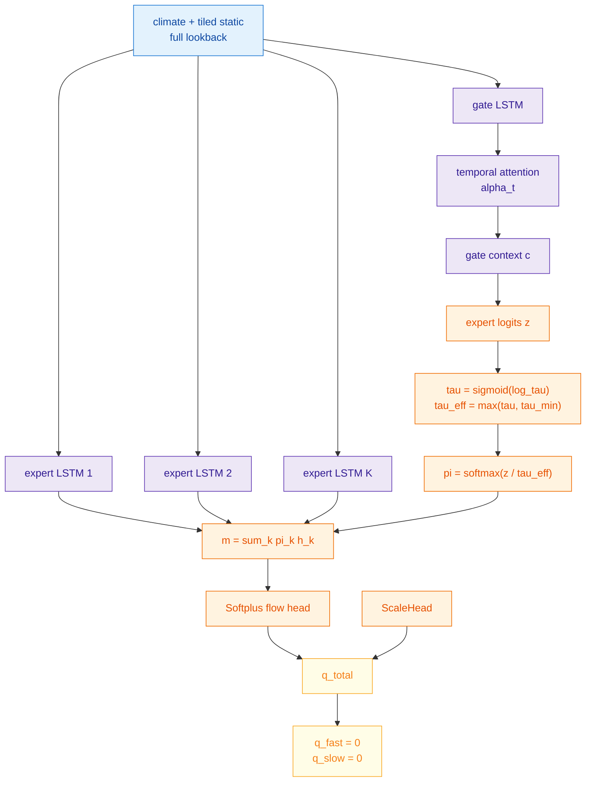
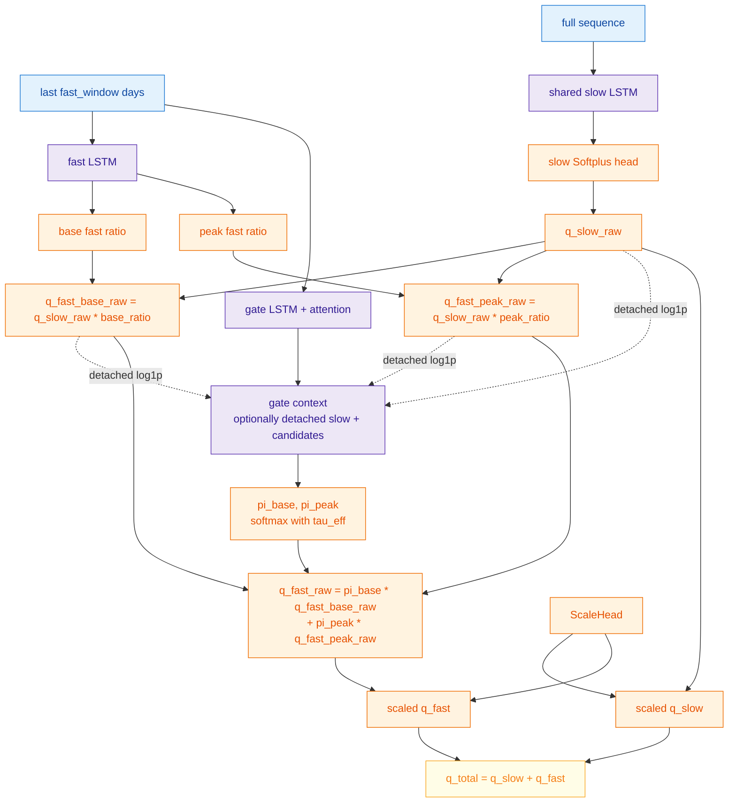
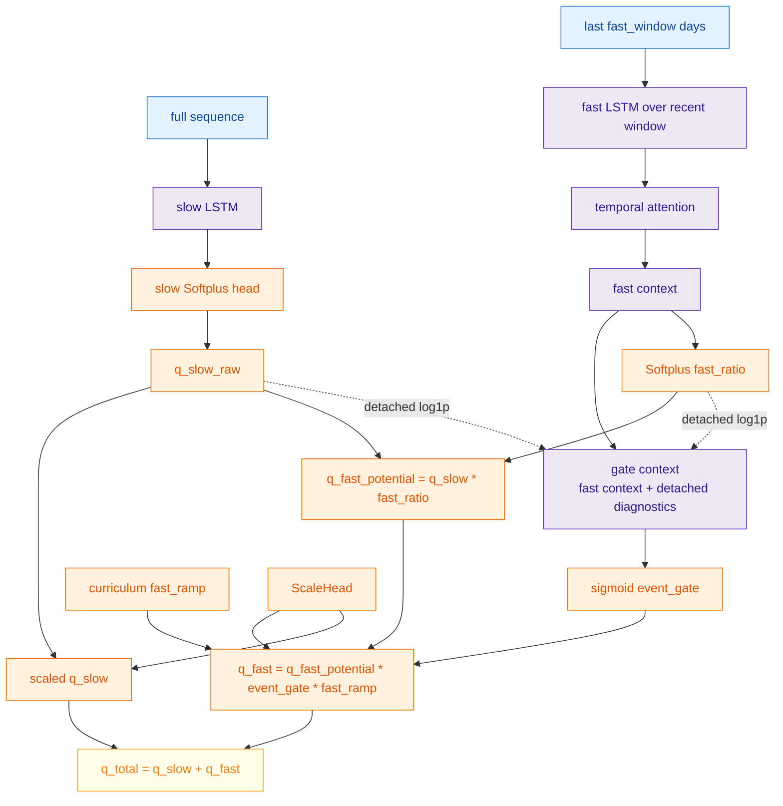

# LSTM Gauge Models

This page documents the active gauge-mode LSTM configurations in `neuralhyd-ca`: the single-LSTM baseline, deterministic dual-pathway LSTM, dual-pathway CMAL probabilistic variant, and unsupervised MoE-tau model.

All models in this family consume watershed-scale daily climate forcing and watershed-scale static attributes. They are hindcast simulators, not operational forecast models: today's streamflow is predicted from observed precipitation and temperature over the lookback window. The models differ in sequence architecture, output head, and regularization, but they share the same data representation, normalization conventions, forward signature, and training entry point.

## Active LSTM Configurations

| Config | Model type | Main purpose |
| --- | --- | --- |
| [cfg_single_lstm.toml](./../../scripts/cfg_single_lstm.toml) | `single` | Conventional static-conditioned recurrent baseline. |
| [cfg_dual_lstm.toml](./../../scripts/cfg_dual_lstm.toml) | `dual` | Main deterministic dual-pathway neural model. |
| [cfg_dual_lstm_cmal.toml](./../../scripts/cfg_dual_lstm_cmal.toml) | `dual` with `output_type = "cmal"` | Dual hidden representation with a probabilistic CMAL output head. |
| [cfg_moe_lstm.toml](./../../scripts/cfg_moe_lstm.toml) | `moe` | Unsupervised mixture-of-experts baseline with learnable softmax temperature. |

All active configs use `training_manifest = "gages"`, the standard watershed-gauge domain. `include_cdec_basins = true` includes CDEC full-natural-flow pseudo-gauges when their flow, climate, and static rows are present.

## Shared Data Flow

Gauge-mode LSTM data are loaded by [dataset.py](./../../src/lstm/dataset.py). The training tuple returned by `HydroDataset.__getitem__` is:

```python
(
    x_dynamic,    # (seq_len, n_dynamic), z-scored climate forcing
    x_static,     # (n_static,), z-scored static attributes
    y_norm,       # scalar, flow_mm_day / precip_mean_b
    y_components, # (2,), [quickflow, baseflow] / precip_mean_b
    basin_id,     # integer gauge id
    precip_mean,  # scalar mm/day, used to denormalize predictions
    loss_weight,  # scalar basin gradient-balancing weight
    extreme_qs,   # (2,), per-basin [q_start, q_top] extreme thresholds
)
```

The active dynamic features are daily `precip_mm`, `tmax_c`, and `tmin_c`. Gauge configs use a watershed attribute set covering topography, drainage network, soil/surface properties, lithology/climate classes, and long-term climate normals.



## Target Units And Normalization

Observed gauge flow is converted from cfs to mm/day using watershed area:

```text
q_mm_day = q_cfs * 0.0283168 * 86400 * 1000 / (area_km2 * 1e6)
         = q_cfs * 2.44577 / area_km2
```

The LSTM target is a dimensionless runoff ratio:

```text
y_b,t = q_mm_day_b,t / precip_mean_b
```

`precip_mean_b` is the mean daily precipitation from the basin climate record, floored at 0.01 mm/day. Evaluation multiplies predictions by the same `precip_mean_b` before computing metrics. This keeps training targets in a compact range while preserving ungauged-basin applicability because precipitation statistics are available without observed streamflow.

Climate and static normalization are computed from training basins only within each fold. Climate values are pooled across all training-basin days for the configured dynamic features. Static means and standard deviations are computed over the effective static feature list after optional climate-static exclusion, grouped static ordering, and log transforms.

Per-basin gradient balancing uses:

```text
loss_weight_b = 1 / max(var(flow_b / precip_mean_b), basin_loss_min_var)^basin_loss_weight_exponent
```

The default exponent is 0.5 in the dataclass; individual configs may choose a lighter exponent. All weighted losses use `sum(w * loss) / sum(w)`, so changing the absolute scale of weights does not change the overall loss magnitude.

## Static Conditioning And Scale Head

All LSTM-family models use a static encoder. The default `StaticEncoder` is a two-layer MLP:

```text
x_static -> Linear(n_static, static_hidden_size) -> ReLU -> Dropout -> Linear(static_hidden_size, static_embedding_dim) -> ReLU
```

The optional `GroupedStaticEncoder` encodes semantic static feature groups separately and fuses their group embeddings. With `static_context_mode = "fused"`, this behaves like a grouped version of the flat encoder: the fused embedding is tiled into the recurrent sequence. With `static_context_mode = "dpl_roles"`, the fused embedding still feeds `ScaleHead` and any static threshold heads, while dual-pathway branches receive role-specific group contexts: slow branches use topography, soil, land cover, snow, and hydroclimate groups; fast/event branches also receive routing groups. The single LSTM keeps using the fused embedding as its sequence context.

The static embedding has two roles:

1. It is tiled across the sequence and concatenated with every daily climate vector.
2. It feeds `ScaleHead`, a learned per-basin multiplicative scale.

`ScaleHead` predicts `log_s`, clamps it to `[-4, 4]`, and returns `exp(log_s)`. Its final layer is zero-initialized, so every basin starts at `scale = 1.0`; the model then learns amplitude corrections under the primary loss.



All active LSTM models return:

```python
q_total, q_fast, q_slow = model(x_dynamic, x_static)
```

Architectures without explicit pathway outputs return zero placeholders for `q_fast` and `q_slow` so training, evaluation, and timeseries export can share one interface.

## Shared Deterministic Losses

For deterministic non-regime models, the primary loss is a weighted blend of MSE and log-MSE on normalized flow:

```text
MSE       = mean_w((q_total - y)^2)
LogMSE    = mean_w((log(q_total + eps) - log(y + eps))^2)
L_primary = (1 - lambda) * MSE + lambda * LogMSE
```

The log term improves relative low-flow sensitivity while keeping ordinary daily MSE central. `log_loss_lambda = 0` gives pure MSE.

Dual-pathway deterministic and CMAL-dual models can add Lyne-Hollick auxiliary supervision. For each basin, the dataset computes a three-pass Lyne-Hollick baseflow estimate and quickflow residual on the observed flow series:

```text
y_slow_LH = baseflow_LH / precip_mean
y_fast_LH = max(flow - baseflow_LH, 0) / precip_mean
L_aux = 0.5 * mean_w((q_slow - y_slow_LH)^2)
      + 0.5 * mean_w(ramp(y) * (q_fast - y_fast_LH)^2)
L_total = L_primary + aux_loss_weight * L_aux
```

The fast auxiliary term can receive a per-basin extreme-flow ramp:

```text
ramp(y) = 1 + (extreme_peak_boost - 1) * clip((y - q_start_b) / (q_top_b - q_start_b), 0, 1)
```

`q_start_b` and `q_top_b` are the basin's configured high-flow quantiles of normalized observed flow. This makes an extreme day high relative to that basin rather than high by a global runoff-ratio threshold.

## CMAL Probabilistic Losses

The CMAL head predicts a mixture of asymmetric Laplace components. For component `k`, the head returns weight `pi_k`, location `mu_k`, left scale `b_l,k`, and right scale `b_r,k`. Locations and scales are positive. `ScaleHead` multiplies `mu`, `b_l`, and `b_r`, so the whole distribution scales by basin rather than only the mean.

The mixture mean used as `q_total` is:

```text
E[Y] = sum_k pi_k * (mu_k + b_r,k - b_l,k)
```

The negative log-likelihood option is:

```text
log f_k(y) = -log(b_l,k + b_r,k) + (y - mu_k) / b_l,k  if y < mu_k
log f_k(y) = -log(b_l,k + b_r,k) - (y - mu_k) / b_r,k  if y >= mu_k
L_NLL      = -mean_w(logsumexp_k(log(pi_k) + log f_k(y)))
```

The active CMAL config uses CRPS. The implementation computes `E|X - y|` analytically per component and estimates `E|X - X'|` with reparameterized asymmetric-Laplace samples:

```text
CRPS(F, y) = E_F |X - y| - 0.5 * E_F |X - X'|
```

Optional regularizers are available: `cmal_entropy_weight` adds negative mixture entropy to discourage component collapse, and `cmal_scale_reg_weight` penalizes scale collapse. The active CMAL config uses entropy regularization and CRPS samples; scale regularization is left at its dataclass default of zero.

## Regime Losses And Curriculum

The supervised regime models use additional labels derived from observed flow quantiles, Lyne-Hollick components, and model-consistent residuals. They can run a smooth-to-daily curriculum controlled by `use_ma_curriculum`.

The smooth target is a trailing moving average of normalized flow:

```text
y_smooth_t = mean(y_{t-ma_window+1}, ..., y_t)
```

During the smooth phase, the model learns a water-balance envelope before daily event specialization is fully active. Once validation loss plateaus after `ma_phase_min_epochs` and `ma_phase_patience`, training reloads the best smooth checkpoint, switches to daily targets, resets selection state, and ramps regime weights in the daily phase.

The high-flow regime label uses per-basin thresholds:

```text
q_peak_b = quantile_b(moe_regime_peak_quantile)
width_b  = (q_peak_max_b - q_peak_min_b) * moe_regime_threshold_softness
peak_soft = sigmoid((y - q_peak_b) / width_b)
regime_targets = [1 - peak_soft, peak_soft]
```

If `moe_regime_threshold_mode = "learned_static"`, a static head predicts a bounded adjustment to the anchor threshold. The active configs use fixed thresholds.

Daily-phase regime losses use the same normalized weighted mean convention as the primary loss. The daily regime weight ramps from `daily_phase_initial_regime_weight` to 1 over `daily_phase_warmup_epochs`.

## Single LSTM Baseline

Config: [cfg_single_lstm.toml](./../../scripts/cfg_single_lstm.toml)

The single LSTM is the conventional neural baseline. One LSTM reads the full 365-day climate-plus-static sequence and predicts total streamflow directly.



Important settings in the active config:

| Setting | Value |
| --- | --- |
| `model_type` | `single` |
| `training_manifest` | `gages` |
| `seq_len` | `365` |
| `single_hidden_size` | `128` |
| `static_embedding_dim` | `10` |
| `dropout` | `0.15` |
| `log_loss_lambda` | `0.05` |
| `basin_loss_weight_exponent` | `0.50` |
| `batch_size` | `512` |
| `use_swa` | `true` |

Use this run as the simplest static-conditioned recurrent comparison floor.

## Single LSTM On The HUC12-Intersect Domain

Config: [cfg_single_lstm_dpl.toml](./../../scripts/cfg_single_lstm_dpl.toml)

This config uses the same single-LSTM architecture as the standard baseline, but changes the training basis:

| Setting | Value |
| --- | --- |
| `model_type` | `single` |
| `training_manifest` | `huc12_intersect` |
| `include_cdec_basins` | `true` |

`training_manifest = "huc12_intersect"` keeps gauges present in the HUC12 manifest and builds folds that keep gauges sharing any HUC12 in the same fold. This is the fair neural comparator for dPL because the basin universe and leakage-control basis are the same.

## Dual-Pathway LSTM

Config: [cfg_dual_lstm.toml](./../../scripts/cfg_dual_lstm.toml)

The deterministic dual LSTM separates sequence modeling into a slow water-balance pathway and a fast event-response pathway. The fast pathway is a dimensionless amplifier of the slow state, so event response scales with antecedent wetness.



When `info_gap = true`, the slow pathway receives only `x[:, :-fast_window, :]`, so it cannot see the fast event window. The active deterministic dual config uses `info_gap = false`, so pathway separation comes from the composition and auxiliary supervision rather than strict input withholding.

Important settings in the active config:

| Setting | Value |
| --- | --- |
| `model_type` | `dual` |
| `training_manifest` | `gages` |
| `seq_len` | `365` |
| `fast_window` | `28` |
| `fast_hidden_size` | `64` |
| `slow_hidden_size` | `108` |
| `aux_loss_weight` | `0.40` |
| `baseflow_alpha` | `0.925` |
| `extreme_start_quantile` | `0.98` |
| `extreme_top_quantile` | `0.995` |
| `extreme_peak_boost` | `30.0` |

## Dual-Pathway LSTM With CMAL

Config: [cfg_dual_lstm_cmal.toml](./../../scripts/cfg_dual_lstm_cmal.toml)

The CMAL variant keeps the dual hidden representation and deterministic pathway heads, but replaces the total-flow point head with a mixture distribution over normalized flow. The deterministic pathway heads remain available for auxiliary loss and diagnostics.



Important settings in the active config:

| Setting | Value |
| --- | --- |
| `model_type` | `dual` |
| `output_type` | `cmal` |
| `fast_window` | `35` |
| `fast_hidden_size` | `48` |
| `slow_hidden_size` | `96` |
| `cmal_n_components` | `3` |
| `cmal_hidden_size` | `64` |
| `cmal_loss` | `crps` |
| `cmal_crps_n_samples` | `50` |
| `cmal_entropy_weight` | `0.10` |
| `aux_loss_weight` | `0.25` |

CMAL intervals should be evaluated with calibration diagnostics; optimizing CRPS does not guarantee exact coverage in every tier or flow regime.

## Unsupervised MoE-Tau

Config: [cfg_moe_lstm.toml](./../../scripts/cfg_moe_lstm.toml)

The unsupervised MoE model runs `K` independent full-lookback LSTM experts. A separate LSTM-attention gate produces mixture weights over expert hidden states. Expert specialization is unlabeled and emerges only through the total-flow objective.



Important settings in the active config:

| Setting | Value |
| --- | --- |
| `model_type` | `moe` |
| `training_manifest` | `gages` |
| `seq_len` | `365` |
| `moe_n_experts` | `3` |
| `moe_expert_hidden_size` | `64` |
| `moe_gate_hidden_size` | `32` |
| `moe_attention_dim` | `16` |
| `moe_tau_init` | `0.25` |
| `moe_tau_min` | `1e-4` |
| `dropout` | `0.10` |

Lower `tau` values sharpen expert selection. `moe_tau_min` prevents the softmax from becoming numerically or behaviorally too hard.

## Dual-LSTM Regime MoE

Config: [cfg_dual_lstm_regime_moe.toml](./../../scripts/cfg_dual_lstm_regime_moe.toml)

The dual-LSTM regime MoE keeps one shared slow pathway and puts regime competition only in the fast response. It has two fast-response candidates: base-response and peak-response. The gate blends the two candidates before adding them to the slow flow.



Daily-phase regime MoE loss structure is:

```text
L_total = w_final * L_final
        + regime_weight * (
            w_slow_aux * L_slow_LH
          + w_fast_aux * L_fast_candidates
          + w_gate * L_gate_CE
          + w_balance * L_balance
          + w_threshold * L_threshold_reg
          + w_frequency * L_frequency_reg
        )
```

`L_final` is blended MSE/log-MSE on `q_total` with extra peak weighting on high-flow-regime samples. `L_fast_candidates` supervises the fast candidates against a target that ramps from Lyne-Hollick quickflow toward `max(y - stopgrad(q_slow), 0)`. `L_gate_CE` is soft cross-entropy against `[base, peak]` targets, with class weights. `L_balance` keeps mean gate probabilities near mean target frequencies. `L_frequency_reg` penalizes mismatch between observed soft regime frequency and the configured quantile frequency.

Important settings in the active config:

| Setting | Value |
| --- | --- |
| `model_type` | `dual_lstm_regime_moe` |
| `training_manifest` | `huc12_intersect` |
| `seq_len` | `365` |
| `fast_window` | `18` |
| `slow_hidden_size` | `128` |
| `fast_hidden_size` | `64` |
| `moe_n_experts` | `2` |
| `moe_tau_init` | `0.70` |
| `moe_tau_min` | `0.45` |
| `moe_regime_peak_quantile` | `0.95` |
| `moe_regime_gate_peak_weight` | `8.0` |
| `moe_regime_fast_residual_alpha` | `0.50` |
| `moe_regime_peak_quiet_weight` | `0.50` |
| `validation_selection_metric` | `nse` |

Timeseries diagnostics can include `q_base`, `q_peak`, `pi_base`, `pi_peak`, `q_fast_base`, `q_fast_peak`, `fast_ratio_base`, and `fast_ratio_peak`.

## Dual-LSTM Regime Gate

Config: [cfg_dual_lstm_regime_gate.toml](./../../scripts/cfg_dual_lstm_regime_gate.toml)

The regime-gate variant uses one fast amplifier rather than base/peak fast candidates. A supervised sigmoid gate throttles that one amplifier. This answers a narrower question than the regime MoE: when should the fast pathway contribute above the slow water-balance envelope?

```text
q_fast_potential = q_slow * fast_ratio
q_fast           = q_fast_potential * event_gate * fast_ramp
q_total          = q_slow + q_fast
                 = q_slow * (1 + event_gate * fast_ratio * fast_ramp)
```



The event target blends the total high-flow label with a residual-over-slow label:

```text
highflow_event = sigmoid((y - q_peak_b) / width_b)
y_fast_resid   = max(y - stopgrad(q_slow), 0)
relative_resid = y_fast_resid / max(stopgrad(q_slow), eps)
resid_event    = sigmoid((relative_resid - residual_ratio_threshold) / residual_ratio_softness)
event_target   = highflow_weight * highflow_event + (1 - highflow_weight) * resid_event
```

Daily-phase regime gate loss structure is:

```text
L_total = w_final * L_final
        + regime_weight * (
            w_slow_aux * L_slow_LH
          + w_fast_aux * (L_fast_residual + w_quiet * L_fast_quiet)
          + w_gate * L_gate_CE
          + w_balance * L_balance
          + w_threshold * L_threshold_reg
          + w_frequency * L_frequency_reg
        )
```

The smooth phase sets `fast_ramp = 0`, trains `q_slow` against the moving-average envelope, penalizes `q_fast_potential` for firing, and lightly pretrains the event gate from the total high-flow quantile. Checkpoint selection is deferred until the daily-phase fast ramp reaches 1.0.

Important settings in the active config:

| Setting | Value |
| --- | --- |
| `model_type` | `dual_lstm_regime_gate` |
| `training_manifest` | `huc12_intersect` |
| `seq_len` | `365` |
| `fast_window` | `18` |
| `slow_hidden_size` | `128` |
| `fast_hidden_size` | `64` |
| `moe_gate_hidden_size` | `48` |
| `moe_attention_dim` | `24` |
| `moe_regime_gate_highflow_weight` | `0.70` |
| `moe_regime_residual_ratio_threshold` | `0.25` |
| `moe_regime_fast_ramp_epochs` | `6` |
| `moe_regime_fast_aux_weight` | `0.35` |
| `moe_regime_peak_quiet_weight` | `0.35` |
| `validation_selection_metric` | `nse` |

Timeseries diagnostics can include `pi_base`, `pi_event`, `q_fast_potential`, `q_fast_gated`, `fast_ratio_event`, `attention_lag`, and `attention_entropy`.

## Training Schedule And Checkpoint Selection

All LSTM-family configs run through [train_kfold.py](./../../scripts/train_kfold.py), which dispatches non-dPL configs to [train.py](./../../src/lstm/train.py). The default schedule is:

1. Build spatial folds from `training_manifest`, `n_folds`, and `seed`.
2. For each fold, compute normalization statistics from training basins only.
3. Train with AdamW, input noise, gradient clipping, warmup, and cosine annealing.
4. Select checkpoints by `validation_selection_metric`, usually validation loss for ordinary LSTMs and NSE for the regime configs.
5. When `use_swa = true`, start a Stochastic Weight Averaging phase after the raw phase plateaus; promote SWA only when it beats the raw checkpoint under the same selection metric.
6. Reload the selected checkpoint and evaluate held-out basins.

For `training_manifest = "huc12_intersect"`, the fold builder reads the HUC12 manifest and groups any gauges sharing at least one HUC12 before assigning groups to folds. This prevents HUC12 forcing leakage across train and validation through nested or overlapping gauges.

Validation loss is batch-averaged, but NSE and KGE are computed per basin in denormalized mm/day and then aggregated by median. The final basin result CSVs also include flow-volume and high/low-flow diagnostics.

## Outputs And Diagnostics

Each LSTM run writes one output directory derived from its config filename, for example `cfg_dual_lstm_regime_gate.toml` writes under `data/training/output/dual_lstm_regime_gate/` unless `output_dir` is set explicitly.

Common outputs are:

- `log.txt`: run-level console log.
- `fold_<n>/loss_curve.csv`: per-epoch training and validation history.
- `fold_<n>/best_model.pt`: canonical checkpoint with `model_state_dict` and normalization stats.
- `fold_<n>/best_raw_model.pt`: raw checkpoint when SWA is enabled.
- `fold_<n>/swa_model.pt`: SWA checkpoint when SWA improves or is evaluated.
- `fold_<n>/basin_results.csv`: held-out basin metrics.
- `fold_<n>/timeseries/<basin_id>.csv`: observed and predicted hydrographs plus model-specific diagnostics.
- `all_fold_results.csv`: concatenated held-out basin metrics across folds.

Diagnostic interpretation depends on architecture. For single/MoE baselines, `q_fast` and `q_slow` are placeholders. For dual and regime models, pathway outputs are useful diagnostics, but they are not observed physical truth; they are shaped by architecture and Lyne-Hollick-derived supervision.

## Main Limitations

Gauge-mode LSTM models treat each watershed as one lumped unit. They do not explicitly simulate internal HUC12 heterogeneity, channel routing, reservoirs, diversions, groundwater pumping, land-use change, or snowpack physics. Static conditioning lets the same climate sequence produce different flow responses in different basins, but the representation remains a learned basin-level mapping.

The dual-pathway and regime outputs are interpretable model components, not measurements. The Lyne-Hollick decomposition is a heuristic target, and per-basin flow quantiles are labels for high-flow behavior rather than direct process observations. Regime models add useful diagnostics but also add failure modes such as gate collapse, delayed specialization, and sensitivity to curriculum settings.
