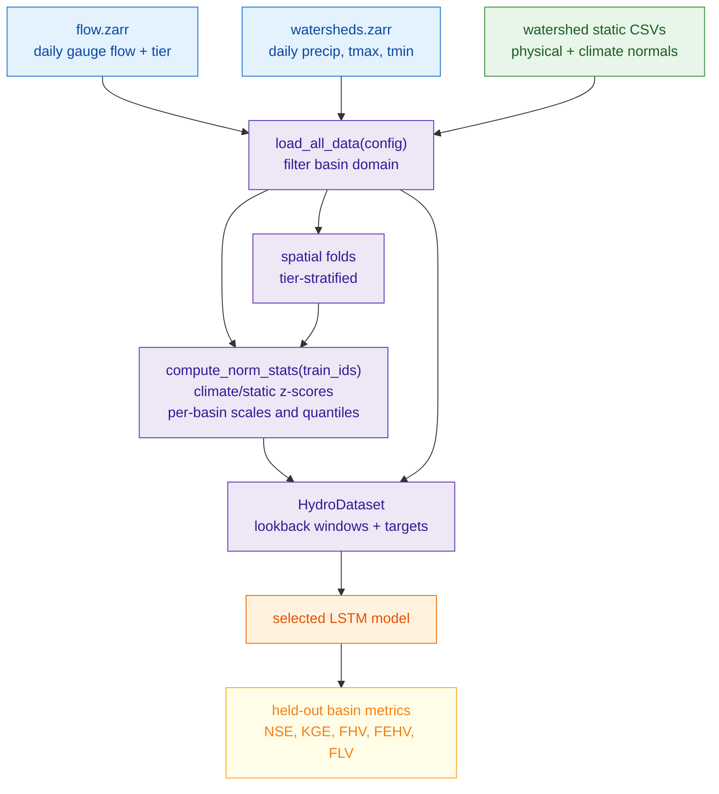
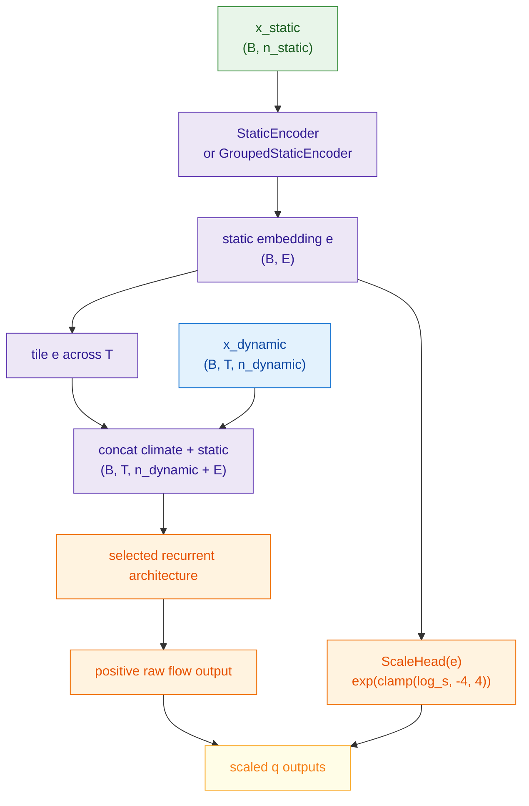
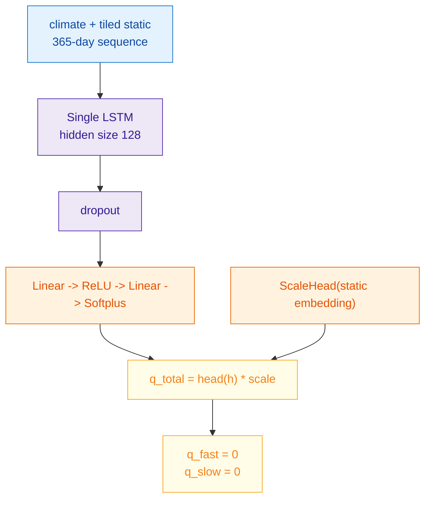
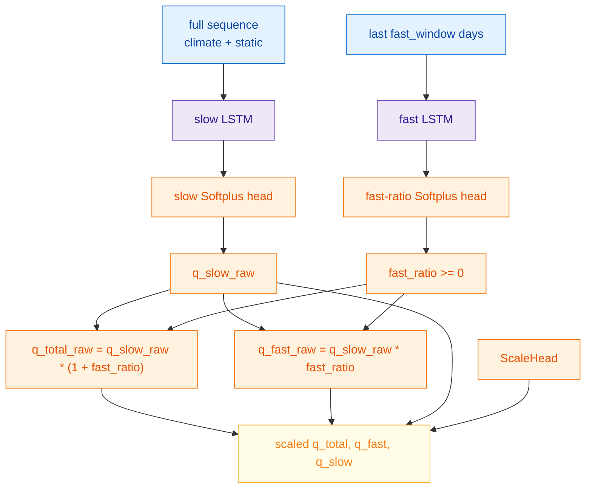
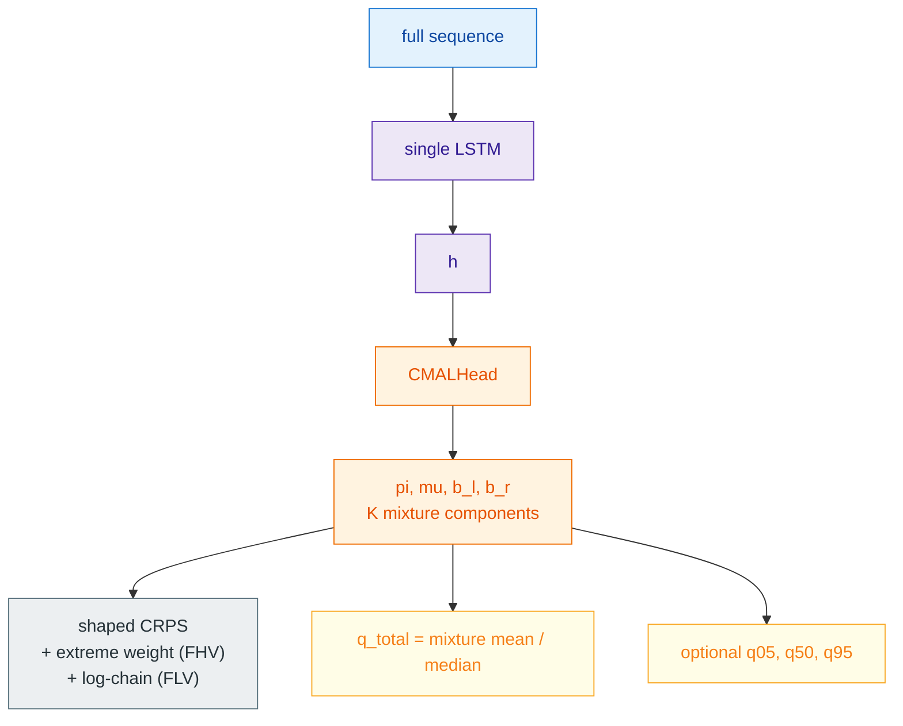
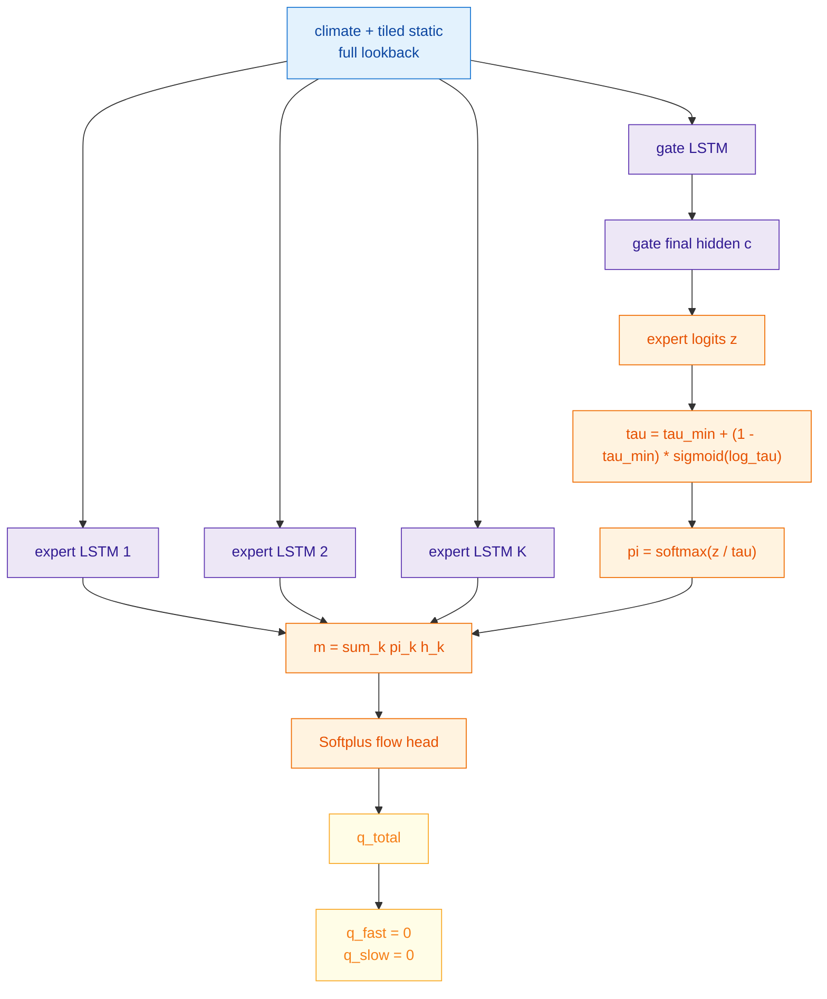

# LSTM Gauge Models

This page documents the active gauge-mode LSTM configurations in `neuralhyd-ca`: the single-LSTM baseline, deterministic dual-pathway LSTM, single-LSTM CMAL probabilistic variant, and unsupervised MoE-tau model.

All models in this family consume watershed-scale daily climate forcing and watershed-scale static attributes. They are hindcast simulators, not operational forecast models: today's streamflow is predicted from observed precipitation and temperature over the lookback window. The models differ in sequence architecture, output head, and regularization, but they share the same data representation, normalization conventions, forward signature, and training entry point.

## Active LSTM Configurations

| Config | Model type | Main purpose |
| --- | --- | --- |
| [cfg_single_lstm.toml](./../../scripts/cfg_single_lstm.toml) | `single` | Conventional static-conditioned recurrent baseline. |
| [cfg_dual_lstm.toml](./../../scripts/cfg_dual_lstm.toml) | `dual` | Main deterministic dual-pathway neural model. |
| [cfg_single_lstm_cmal.toml](./../../scripts/cfg_single_lstm_cmal.toml) | `single` with `output_type = "cmal"` | Single hidden state with a probabilistic CMAL head; point read off the mixture, FDC tails shaped through the CRPS. |
| [cfg_moe_lstm.toml](./../../scripts/cfg_moe_lstm.toml) | `moe` | Unsupervised mixture-of-experts baseline with learnable softmax temperature. |

All active configs use `training_manifest = "gages"`, the standard watershed-gauge domain. `include_cdec_basins = true` includes CDEC full-natural-flow pseudo-gauges when their flow, climate, and static rows are present.

## Shared Data Flow

Gauge-mode LSTM data are loaded by [dataset.py](./../../src/lstm/dataset.py). The training tuple returned by `HydroDataset.__getitem__` is:

```python
(
    x_dynamic,    # (seq_len, n_dynamic), z-scored climate forcing
    x_static,     # (n_static,), z-scored static attributes
    y_norm,       # scalar, flow_mm_day / precip_mean_b
    y_components, # (2,), [quickflow, baseflow] / precip_mean_b
    basin_id,     # integer gauge id
    precip_mean,  # scalar mm/day, used to denormalize predictions
    loss_weight,  # scalar basin gradient-balancing weight
    extreme_qs,   # (2,), per-basin [q_start, q_top] extreme thresholds
)
```

The active dynamic features are daily `precip_mm`, `tmax_c`, and `tmin_c`. Gauge configs use a watershed attribute set covering topography, drainage network, soil/surface properties, lithology/climate classes, and long-term climate normals.



## Target Units And Normalization

Observed gauge flow is converted from cfs to mm/day using watershed area:

```text
q_mm_day = q_cfs * 0.0283168 * 86400 * 1000 / (area_km2 * 1e6)
         = q_cfs * 2.44577 / area_km2
```

The LSTM target is a dimensionless runoff ratio:

```text
y_b,t = q_mm_day_b,t / precip_mean_b
```

`precip_mean_b` is the mean daily precipitation from the basin climate record, floored at 0.01 mm/day. Evaluation multiplies predictions by the same `precip_mean_b` before computing metrics. This keeps training targets in a compact range while preserving ungauged-basin applicability because precipitation statistics are available without observed streamflow.

Climate and static normalization are computed from training basins only within each fold. Climate values are pooled across all training-basin days for the configured dynamic features. Static means and standard deviations are computed over the effective static feature list after optional climate-static exclusion, grouped static ordering, and log transforms.

Per-basin gradient balancing uses:

```text
loss_weight_b = 1 / max(var(flow_b / precip_mean_b), basin_loss_min_var)^basin_loss_weight_exponent
```

The default exponent is 0.5 in the dataclass; individual configs may choose a lighter exponent. All weighted losses use `sum(w * loss) / sum(w)`, so changing the absolute scale of weights does not change the overall loss magnitude.

## Static Conditioning And Scale Head

All LSTM-family models use a static encoder. The default `StaticEncoder` is a two-layer MLP:

```text
x_static -> Linear(n_static, static_hidden_size) -> ReLU -> Dropout -> Linear(static_hidden_size, static_embedding_dim) -> ReLU
```

The optional `GroupedStaticEncoder` encodes semantic static feature groups separately and fuses their group embeddings. With `static_context_mode = "fused"`, this behaves like a grouped version of the flat encoder: the fused embedding is tiled into the recurrent sequence. With `static_context_mode = "dpl_roles"`, the fused embedding still feeds `ScaleHead` and any static threshold heads, while dual-pathway branches receive role-specific group contexts: slow branches use topography, soil, land cover, snow, and hydroclimate groups; fast/event branches also receive routing groups. The single LSTM keeps using the fused embedding as its sequence context.

The static embedding has two roles:

1. It is tiled across the sequence and concatenated with every daily climate vector.
2. It feeds `ScaleHead`, a learned per-basin multiplicative scale.

`ScaleHead` predicts `log_s`, clamps it to `[-4, 4]`, and returns `exp(log_s)`. Its final layer is zero-initialized, so every basin starts at `scale = 1.0`; the model then learns amplitude corrections under the primary loss.



All active LSTM models return:

```python
q_total, q_fast, q_slow = model(x_dynamic, x_static)
```

Architectures without explicit pathway outputs return zero placeholders for `q_fast` and `q_slow` so training, evaluation, and timeseries export can share one interface.

## Shared Deterministic Losses

For deterministic non-regime models, the primary loss is a weighted blend of MSE and log-MSE on normalized flow:

```text
MSE       = mean_w((q_total - y)^2)
LogMSE    = mean_w((log(q_total + eps) - log(y + eps))^2)
L_primary = (1 - lambda) * MSE + lambda * LogMSE
```

The log term improves relative low-flow sensitivity while keeping ordinary daily MSE central. `log_loss_lambda = 0` gives pure MSE.

The deterministic dual-pathway model can add Lyne-Hollick auxiliary supervision. For each basin, the dataset computes a three-pass Lyne-Hollick baseflow estimate and quickflow residual on the observed flow series:

```text
y_slow_LH = baseflow_LH / precip_mean
y_fast_LH = max(flow - baseflow_LH, 0) / precip_mean
L_aux = 0.5 * mean_w((q_slow - y_slow_LH)^2)
      + 0.5 * mean_w(ramp(y) * (q_fast - y_fast_LH)^2)
L_total = L_primary + aux_loss_weight * L_aux
```

The fast auxiliary term can receive a per-basin extreme-flow ramp:

```text
ramp(y) = 1 + (extreme_peak_boost - 1) * clip((y - q_start_b) / (q_top_b - q_start_b), 0, 1)
```

`q_start_b` and `q_top_b` are the basin's configured high-flow quantiles of normalized observed flow. This makes an extreme day high relative to that basin rather than high by a global runoff-ratio threshold.

## CMAL Probabilistic Losses

The CMAL head predicts a mixture of asymmetric Laplace components. For component `k`, the head returns weight `pi_k`, location `mu_k`, left scale `b_l,k`, and right scale `b_r,k`. Locations and scales are positive. Per-basin amplitude is carried by the static embedding and the runoff-ratio target normalization, not a separate scale head.

The point prediction `q_total` is read directly off the mixture. When `cmal_point_estimate = "mean"` it is the mixture mean:

```text
E[Y] = sum_k pi_k * (mu_k + b_r,k - b_l,k)
```

When `cmal_point_estimate = "median"` it is the pi-weighted component median (`sum_k pi_k * Q_ALD,k(0.5)`), which sits lower than the mean for a right-skewed mixture and pairs better with a log-shaped low tail. The FDC tails are not bent by a separate head; they are shaped by the loss itself (next section).

The negative log-likelihood option is:

```text
log f_k(y) = -log(b_l,k + b_r,k) + (y - mu_k) / b_l,k  if y < mu_k
log f_k(y) = -log(b_l,k + b_r,k) - (y - mu_k) / b_r,k  if y >= mu_k
L_NLL      = -mean_w(logsumexp_k(log(pi_k) + log f_k(y)))
```

The active CMAL config uses CRPS. The implementation computes `E|X - y|` analytically per component and estimates `E|X - X'|` with reparameterized asymmetric-Laplace samples:

```text
CRPS(F, y) = E_F |X - y| - 0.5 * E_F |X - X'|
```

Optional regularizers are available: `cmal_entropy_weight` adds negative mixture entropy to discourage component collapse, and `cmal_scale_reg_weight` penalizes scale collapse. The active CMAL config uses entropy regularization and CRPS samples; scale regularization is left at its dataclass default of zero.

### Shaping the FDC tails through the loss

Rather than a separate point head, the peak and recession behavior is tuned by shaping the CRPS itself — the tractable corner of threshold-weighted CRPS (chaining `v`):

```text
L_CRPS = (1 - lambda) * CRPS_abs[ w_extreme ] + lambda * CRPS_log
L_total = L_CRPS + cmal_entropy_weight * H_neg(pi)
```

- **FLV lever (`cmal_log_crps_lambda = lambda`)** blends in a log-space energy score `CRPS_log`, computed from the same ALD samples on `log(flow)` (floor `log_loss_epsilon`). Because log-space is scale-invariant, it rewards proportional fidelity at low flows and pulls the recession fit down — directly targeting FLV, a log-shape FDC metric — without being drowned by high-flow absolute errors. (A pure relative/normalized CRPS was rejected: it only reweights the absolute metric — the same family as an earlier low-flow CRPS reweighting that flattened the tail and worsened FLV.)
- **FHV lever (`cmal_extreme_weight`)** multiplies each sample's CRPS by the per-basin `extreme_ramp_weight` (ramps 1 → `extreme_peak_boost` between `extreme_start_quantile` and `extreme_top_quantile`), so the mixture fits rare peaks instead of averaging them away.

Both levers default off and are independently toggleable, so each metric (FLV, FHV) can be ablated against the baseline.

## Single LSTM Baseline

Config: [cfg_single_lstm.toml](./../../scripts/cfg_single_lstm.toml)

The single LSTM is the conventional neural baseline. One LSTM reads the full 365-day climate-plus-static sequence and predicts total streamflow directly.



Important settings in the active config:

| Setting | Value |
| --- | --- |
| `model_type` | `single` |
| `training_manifest` | `gages` |
| `include_cdec_basins` | `true` |
| `seq_len` | `365` |
| `single_hidden_size` | `128` |
| `static_embedding_dim` | `10` |
| `dropout` | `0.15` |
| `log_loss_lambda` | `0.05` |
| `basin_loss_weight_exponent` | `0.50` |
| `batch_size` | `512` |
| `use_swa` | `true` |

Use this run as the simplest static-conditioned recurrent comparison floor.

## Dual-Pathway LSTM

Config: [cfg_dual_lstm.toml](./../../scripts/cfg_dual_lstm.toml)

The deterministic dual LSTM separates sequence modeling into a slow water-balance pathway and a fast event-response pathway. The fast pathway is a dimensionless amplifier of the slow state, so event response scales with antecedent wetness.



When `info_gap = true`, the slow pathway receives only `x[:, :-fast_window, :]`, so it cannot see the fast event window. The active deterministic dual config uses `info_gap = false`, so pathway separation comes from the composition and auxiliary supervision rather than strict input withholding.

Important settings in the active config:

| Setting | Value |
| --- | --- |
| `model_type` | `dual` |
| `training_manifest` | `gages` |
| `include_cdec_basins` | `true` |
| `seq_len` | `365` |
| `fast_window` | `28` |
| `fast_hidden_size` | `64` |
| `slow_hidden_size` | `108` |
| `aux_loss_weight` | `0.40` |
| `baseflow_alpha` | `0.925` |
| `extreme_start_quantile` | `0.98` |
| `extreme_top_quantile` | `0.995` |
| `extreme_peak_boost` | `30.0` |
| `log_loss_lambda` | `0.05` |
| `basin_loss_weight_exponent` | `0.25` |
| `batch_size` | `512` |
| `use_swa` | `true` |

## Single LSTM With CMAL

Config: [cfg_single_lstm_cmal.toml](./../../scripts/cfg_single_lstm_cmal.toml)

The CMAL variant uses the single-LSTM hidden state and adds a mixture distribution over normalized flow. A single shaped CRPS trains the full distribution on one clean hidden state; the point prediction `q_total` is read directly off the mixture (mean or median). FHV/FLV are tuned by shaping that CRPS (extreme sample-weighting + a log-space chained term), not by a separate head. The dual pathway is deterministic-only and does not carry a CMAL head.



Important settings in the active config:

| Setting | Value |
| --- | --- |
| `model_type` | `single` |
| `output_type` | `cmal` |
| `single_hidden_size` | `128` |
| `cmal_n_components` | `3` |
| `cmal_hidden_size` | `64` |
| `cmal_loss` | `crps` |
| `cmal_crps_n_samples` | `50` |
| `cmal_entropy_weight` | `0.05` |
| `cmal_point_estimate` | `mean` |
| `cmal_log_crps_lambda` | `0.3` |
| `cmal_extreme_weight` | `true` |
| `extreme_peak_boost` | `5.0` |

CMAL intervals should be evaluated with calibration diagnostics; optimizing CRPS does not guarantee exact coverage in every tier or flow regime.

## Unsupervised MoE-Tau

Config: [cfg_moe_lstm.toml](./../../scripts/cfg_moe_lstm.toml)

The unsupervised MoE model runs `K` independent full-lookback LSTM experts. A separate gate LSTM produces mixture weights over expert hidden states from its final hidden state. Expert specialization is unlabeled and emerges only through the total-flow objective.



Important settings in the active config:

| Setting | Value |
| --- | --- |
| `model_type` | `moe` |
| `training_manifest` | `gages` |
| `seq_len` | `365` |
| `moe_n_experts` | `3` |
| `moe_expert_hidden_size` | `64` |
| `moe_gate_hidden_size` | `32` |
| `moe_tau_init` | `0.25` |
| `moe_tau_min` | `1e-4` |
| `dropout` | `0.10` |

Lower `tau` values sharpen expert selection. `moe_tau_min` prevents the softmax from becoming numerically or behaviorally too hard.

## Training Schedule And Checkpoint Selection

All LSTM-family configs run through [train_kfold.py](./../../scripts/train_kfold.py), which dispatches to [train.py](./../../src/lstm/train.py). The default schedule is:

1. Build spatial folds from `training_manifest`, `n_folds`, and `seed`.
2. For each fold, compute normalization statistics from training basins only.
3. Train with AdamW, input noise, gradient clipping, warmup, and cosine annealing.
4. Select checkpoints by `validation_selection_metric`, usually validation loss.
5. When `use_swa = true`, start a Stochastic Weight Averaging phase after the raw phase exhausts its `patience` budget; the raw best is saved as `best_raw_model.pt`. The SWA phase runs up to `swa_patience` additional epochs at the fixed `swa_lr`, with the patience counter reset. SWA weights are saved as `swa_model.pt` and promoted to `best_model.pt` only when they improve on the raw best under the same selection metric; otherwise `best_raw_model.pt` is promoted.
6. Reload the selected checkpoint and evaluate held-out basins.

Validation loss is batch-averaged, but NSE and KGE are computed per basin in denormalized mm/day and then aggregated by median. The final basin result CSVs also include flow-volume and high/low-flow diagnostics.

## Evaluation Metrics

Five scalar metrics are computed per basin in denormalized mm/day and then aggregated by tier median:

- **NSE** (Nash–Sutcliffe Efficiency): `1 - Σ(obs-sim)² / Σ(obs-mean)²`. Perfect = 1; climatological mean = 0; worse than mean < 0.
- **KGE** (Kling–Gupta Efficiency): `1 - √[(r-1)² + (β-1)² + (γ-1)²]`. Decomposes error into correlation (*r*), bias ratio (*β*), and variability ratio (*γ*).
- **FHV** (High-flow volume bias): percent bias over the top 2 % of the flow-duration curve.
- **FeHV** (Extreme high-flow volume bias): percent bias over the top 1 % of the flow-duration curve.
- **FLV** (Low-flow volume bias): percent bias over the bottom 30 % of the flow-duration curve.

Tier 2 (transitional mixed rain/snow) median NSE and KGE are the headline cross-validation metrics. All five metrics are written to `fold_<n>/basin_results.csv` and aggregated in `all_fold_results.csv`.

## Outputs And Diagnostics

Each LSTM run writes one output directory derived from its config filename, for example `cfg_dual_lstm.toml` writes under `data/training/output/dual_lstm/` unless `output_dir` is set explicitly.

Common outputs are:

- `log.txt`: run-level console log.
- `fold_<n>/loss_curve.csv`: per-epoch training and validation history.
- `fold_<n>/best_model.pt`: canonical checkpoint with `model_state_dict` and normalization stats.
- `fold_<n>/best_raw_model.pt`: raw checkpoint when SWA is enabled.
- `fold_<n>/swa_model.pt`: SWA checkpoint when SWA improves or is evaluated.
- `fold_<n>/basin_results.csv`: held-out basin metrics.
- `fold_<n>/timeseries/<basin_id>.csv`: observed and predicted hydrographs plus model-specific diagnostics.
- `all_fold_results.csv`: concatenated held-out basin metrics across folds.

Diagnostic interpretation depends on architecture. For single/MoE baselines, `q_fast` and `q_slow` are placeholders. For dual and regime models, pathway outputs are useful diagnostics, but they are not observed physical truth; they are shaped by architecture and Lyne-Hollick-derived supervision.

## CDEC FNF Basin Evaluation

14 CDEC full-natural-flow (FNF) reservoir basins are included in training when `include_cdec_basins = true`. These are pseudo-gauges (IDs ≥ 990 000 000) reconstructed from reservoir inflow records. BND is excluded due to missing static attributes. Station-to-PourPtID mappings are defined in `src/eval/cdec.py:CDEC_MAP`.

A dedicated post-training comparison (`post_process.py --cdec-barplot`) evaluates trained neural models against the conventional **SAC-SMA** model over the post-calibration window **2003-10-01 – 2018-09-30**. SAC-SMA daily simulations (mm/day) are in `data/external/sacsma15cdec/climate_historical/`. The comparison covers NSE, KGE, FHV, FeHV, and FLV across all 14 basins:

```bash
python scripts/post_process.py --cdec-barplot dual_lstm single_lstm
```

The SAC-SMA series is also served by the Streamflow Explorer web app on CDEC basin timeseries charts (converted to CFS using the same mm/day → CFS factor applied to LSTM outputs).

## Main Limitations

Gauge-mode LSTM models treat each watershed as one lumped unit. They do not explicitly simulate internal HUC12 heterogeneity, channel routing, reservoirs, diversions, groundwater pumping, land-use change, or snowpack physics. Static conditioning lets the same climate sequence produce different flow responses in different basins, but the representation remains a learned basin-level mapping.

The dual-pathway and regime outputs are interpretable model components, not measurements. The Lyne-Hollick decomposition is a heuristic target, and per-basin flow quantiles are labels for high-flow behavior rather than direct process observations. Regime models add useful diagnostics but also add failure modes such as gate collapse, delayed specialization, and sensitivity to curriculum settings.
