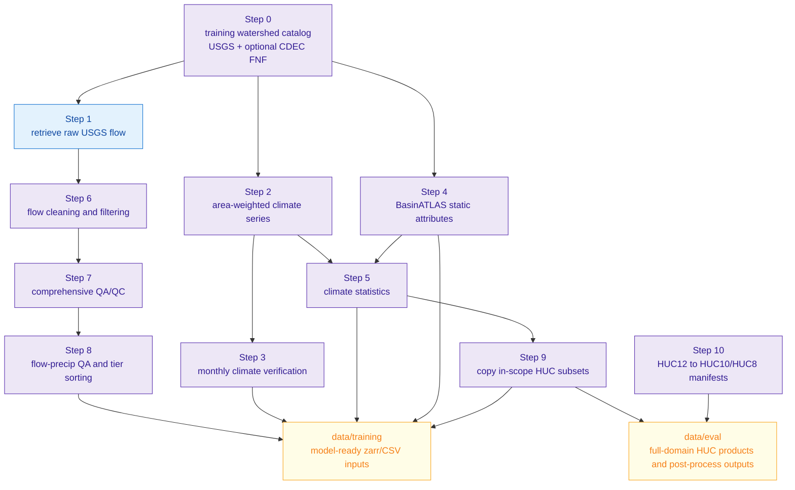

# Model Documentation Overview

This directory documents the active modeling approaches in `neuralhyd-ca`. The root [README.md](./../../README.md) stays short; these pages carry implementation-level architecture, data, loss, and training details.

Run-specific metrics are not repeated here because they change as experiments are retrained. For current results, use `data/training/output/<run>/all_fold_results.csv`, `data/training/output/<run>/fold_<n>/basin_results.csv`, or post-processing outputs under `data/eval/`.

## Active Configurations

| Config | Family page | Entry point |
| --- | --- | --- |
| [cfg_single_lstm.toml](./../../scripts/cfg_single_lstm.toml) | [Single LSTM baseline](lstm.md#single-lstm-baseline) | `python scripts/train_kfold.py scripts/cfg_single_lstm.toml` |
| [cfg_dual_lstm.toml](./../../scripts/cfg_dual_lstm.toml) | [Dual-pathway LSTM](lstm.md#dual-pathway-lstm) | `python scripts/train_kfold.py scripts/cfg_dual_lstm.toml` |
| [cfg_dual_lstm_cmal.toml](./../../scripts/cfg_dual_lstm_cmal.toml) | [Dual-pathway LSTM with CMAL](lstm.md#dual-pathway-lstm-with-cmal) | `python scripts/train_kfold.py scripts/cfg_dual_lstm_cmal.toml` |
| [cfg_moe_lstm.toml](./../../scripts/cfg_moe_lstm.toml) | [Unsupervised MoE-tau](lstm.md#unsupervised-moe-tau) | `python scripts/train_kfold.py scripts/cfg_moe_lstm.toml` |

### Grouped Static Encoder Variants

Two additional configs swap the default flat static-attribute MLP for a
**grouped** encoder (`static_attribute_mode = "grouped"`) that gives each
semantic group of watershed attributes (topography, routing, soil,
land_cover, hydroclimate) its own small sub-encoder before a fusion
layer. Group membership is declared in the config's
`[static_feature_groups]` table; `static_group_dropout` randomly drops
whole groups during training as a regularizer.

| Config | Base architecture |
| --- | --- |
| [cfg_single_lstm_grouped_static.toml](./../../scripts/cfg_single_lstm_grouped_static.toml) | Single LSTM with grouped static encoder |
| [cfg_dual_lstm_grouped_static.toml](./../../scripts/cfg_dual_lstm_grouped_static.toml) | Dual-pathway LSTM with grouped static encoder |

## Modeling Goal

The project predicts daily streamflow for California watersheds from observed daily climate forcing and static watershed attributes. The models are hindcast simulators: they use the observed precipitation and temperature context for the target day, not weather forecasts. The practical question is: given the historical climate record and the basin attributes, what streamflow should this watershed produce today?

The active model family is the LSTM gauge model: these predict gauge-scale flow directly from watershed climate sequences and static watershed attributes. See [lstm.md](./lstm.md).

## Data Preparation Pipeline

The main data-preparation entry point is [prepare_data.py](./../../scripts/prepare_data.py). It builds training/evaluation inputs from raw gauge flow, watershed geometries, gridded climate, BasinATLAS/static products, and HUC overlays.



Important preparation concepts:

- `--target watersheds` writes watershed products directly under `data/training/{climate,static}/watersheds/`.
- `--target huc8`, `huc10`, or `huc12` writes full-domain products under `data/eval/{climate,static}/<level>/`; step 9 materializes the model-training subset under `data/training/{climate,static}/<level>/`.
- Step 0 can include or exclude CDEC full-natural-flow basins. Model configs still have `include_cdec_basins` because a run may intentionally exclude them even when prepared data exist.
- Step 8 assigns hydroclimatic tiers used for fold stratification and reporting.

## Training Inputs And Storage Layout

Active training consumes these prepared products:

| Product | Purpose |
| --- | --- |
| `data/training/flow.zarr` | Daily gauge flow and tier metadata. |
| `data/training/climate/watersheds.zarr` | Daily watershed-mean `precip_mm`, `tmax_c`, `tmin_c`. |
| `data/training/static/watersheds/*.csv` | Watershed physical attributes and climate statistics keyed by `PourPtID`. |

All active training scripts are run from the repository root with the `neuralhyd` environment. The unified cross-validation entry point is [train_kfold.py](./../../scripts/train_kfold.py):

```bash
python scripts/train_kfold.py scripts/cfg_dual_lstm.toml
python scripts/train_kfold.py scripts/cfg_single_lstm.toml
```

## Training Basis And Leakage Control

Every active model is trained with spatial cross-validation: basins are split, not timesteps. The goal is ungauged-basin generalization, so no basin appears in both train and validation within a fold.

All active configs use `training_manifest = "gages"`, which uses the gauge watershed domain after optional CDEC filtering and source intersection. The active trained runs include 210 USGS gauge watersheds plus 14 CDEC FNF pseudo-gauge basins (224 total) after QA/QC filtering and static-attribute intersection. Normalization statistics are computed from training basins only. Validation basins are held out for statistics, model fitting, and checkpoint selection except for their fixed metadata needed to construct tensors and report metrics.



```mermaid
flowchart LR
    Config["TOML config<br/>model_type"]:::input
    Load["load_all_data()"]:::seq
    Fold["build spatial folds"]:::seq
    Norm["training-only normalization"]:::seq
    Train["train fold model"]:::head
    Select["select checkpoint<br/>loss, NSE, or KGE"]:::head
    Eval["held-out evaluation"]:::output
    Aggregate["all_fold_results.csv"]:::output

    Config --> Load --> Fold --> Norm --> Train --> Select --> Eval --> Aggregate

    classDef input fill:#e3f2fd,stroke:#1976d2,color:#0d47a1
    classDef seq fill:#ede7f6,stroke:#5e35b1,color:#311b92
    classDef head fill:#fff3e0,stroke:#ef6c00,color:#e65100
    classDef output fill:#fffde7,stroke:#f9a825,color:#f57f17
```

## Hydroclimatic Tiers

The tier split is used for fold balance and interpretation:

- Tier 1: warmer, lower-elevation rainfall-dominated basins.
- Tier 2: transitional mixed rain-snow basins. This is usually the hardest generalization target and is often the most useful single diagnostic of model quality.
- Tier 3: colder, higher-elevation snow-influenced basins where long memory matters.

Held-out metrics are reported by tier and across all basins. This avoids one aggregate score hiding systematic failures in snow, rain, or mixed-regime watersheds.

## Normalization And Units

Gauge-mode LSTM targets are converted from cfs to mm/day, then divided by each basin's mean daily precipitation to form a runoff ratio. LSTM evaluation multiplies predictions back by the same precipitation scale before computing metrics.

Climate inputs and static attributes are z-scored with training-basin statistics only. Heavy-tailed static attributes listed in `log_transform_static` are log10-transformed first.

## Losses And Checkpoint Selection

LSTM deterministic configs use weighted MSE/log-MSE blends, optional pathway auxiliary losses, and optional CMAL CRPS/NLL. Details are in [docs/models/lstm.md](lstm.md#shared-deterministic-losses).

Checkpoint selection is config-specific via `validation_selection_metric`: `"loss"` (default), `"nse"`, or `"kge"`.

## Outputs And Post-Processing

Typical training outputs are:

- `data/training/output/<run>/log.txt`
- `data/training/output/<run>/all_fold_results.csv`
- `data/training/output/<run>/fold_<n>/best_model.pt`
- `data/training/output/<run>/fold_<n>/basin_results.csv`
- `data/training/output/<run>/fold_<n>/timeseries/<basin_id>.csv`

Post-processing is handled by [post_process.py](./../../scripts/post_process.py):

```bash
python scripts/post_process.py --eval dual_lstm single_lstm          # per-basin metrics → data/eval/*_kfold.csv
python scripts/post_process.py --cdf --barplot --runs dual_lstm ...  # CDF + median barplot PNGs
python scripts/post_process.py --simulate dual_lstm --target training_watersheds  # historical sim CSVs
python scripts/post_process.py --cdec-barplot dual_lstm single_lstm  # SAC-SMA vs neural on 14 CDEC basins
```

After regenerating sim products, run `python -m app.build_data` to refresh the Streamflow Explorer app's Parquet bundles in `app/data/timeseries/`.

## Code Map

Important implementation files:

- [config.py](./../../src/lstm/config.py): LSTM config dataclass and TOML loading.
- [dataset.py](./../../src/lstm/dataset.py): gauge-mode loading, folds, normalization, and datasets.
- [model.py](./../../src/lstm/model.py): single, dual, CMAL, and MoE LSTM architectures.
- [train.py](./../../src/lstm/train.py): LSTM training loop, SWA, and checkpoint I/O.
- [loss.py](./../../src/lstm/loss.py): LSTM training losses and evaluation metrics.
- [src/data/](../../src/data): data preparation modules called by [prepare_data.py](./../../scripts/prepare_data.py).
